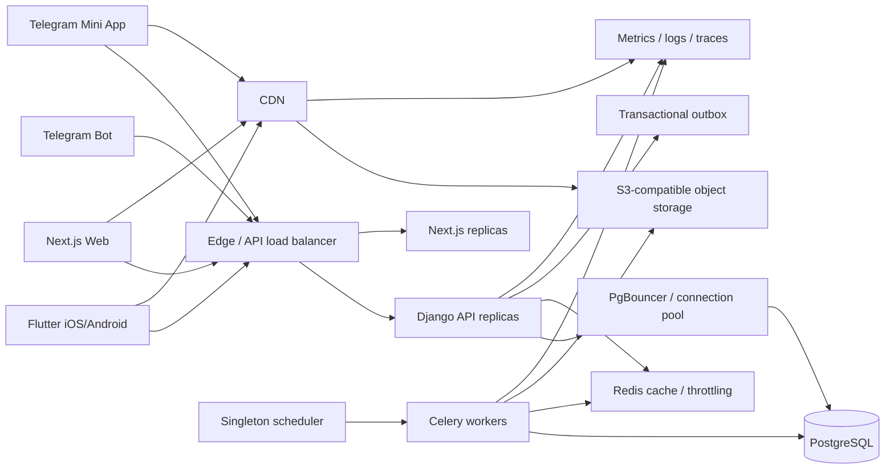

# Архитектура расширения и масштабирования

Дата фиксации: 24 августа 2026 года

Этот документ дополняет [техническое задание](../thoughts/shared/specs/2026-08-09-quran-platform-backend.md)
и определяет, как Quran Platform должна расти по двум независимым направлениям:

1. от небольшого production-запуска до 100 000 DAU без предварительной покупки мощности;
2. от Quran MVP до многодоменной платформы с мобильным приложением, web, Telegram Mini App,
   дуа, переводами, тафсирами, карточками заучивания и последующими типами контента.

Документ задаёт архитектурные границы и критерии перехода. Он не является обещанием
немедленно развернуть инфраструктуру целевого размера.

## 1. Основные решения

- Backend остаётся модульным монолитом Django, пока измеримые причины не оправдают извлечение
  отдельного сервиса.
- Flutter iOS/Android, web и Telegram Mini App используют один версионированный API и одну
  модель пользователя, но имеют отдельные platform adapters и разные offline-возможности.
- API, web и Celery workers не хранят пользовательское состояние на локальном диске и могут
  запускаться в нескольких репликах.
- PostgreSQL является источником истины для транзакционных данных; Redis и CDN можно очистить
  и восстановить без потери канонического состояния.
- Публичный контент и media публикуются immutable-версиями. Аудиобайты, страницы Мусхафа,
  datasets и крупные offline-пакеты не проходят через Django.
- Начальная инфраструктура остаётся минимальной. Новые реплики, HA, read replicas,
  партиционирование и выделенные сервисы добавляются только по метрикам и нагрузочным тестам.
- Функциональные домены расширяются через явные контракты, а не через универсальные таблицы,
  `GenericForeignKey` или прямые импорты чужих ORM-моделей.

## 2. Целевая схема

На beta допускается одна реплика каждого процесса и один Redis. Схема показывает точки
расширения, а не минимальный набор оплачиваемых ресурсов.

## 3. Контракт для всех клиентов

API не должен предполагать, что запрос пришёл из браузера. Бизнес-endpoint'ы проектируются
одинаково для Flutter, web и Telegram Mini App:

- transport JSON/OpenAPI не содержит UI-специфичных структур;
- access token и device context работают без cookie; web может использовать BFF и HttpOnly
  cookie как дополнительную защиту браузерного клиента;
- Telegram `initData` проверяется отдельным auth adapter, после чего backend выдаёт обычную
  платформенную сессию;
- идемпотентность, cursor sync и conflict protocol одинаковы для всех клиентов;
- публичные catalog endpoint'ы не требуют `Authorization` и кэшируются на edge;
- platform capabilities (`background_audio`, `offline_packages`, `push`, `telegram_theme`)
  объявляются клиентом либо определяются по типу устройства, но не меняют каноническую модель;
- OpenAPI проходит compatibility check, а Flutter/TypeScript SDK генерируются из одной схемы;
- breaking change требует `/v2` либо периода совместимости с deprecation headers.

### Возможности клиентов

| Возможность | Flutter | Web | Telegram Mini App |
|---|---|---|---|
| Offline-first локальная БД | Полная | Ограниченная/PWA | Небольшое device storage |
| Фоновое аудио и lock screen | Гарантируемый native flow | В пределах браузера | Только пока жив WebView |
| Крупные offline audio packages | Да | Ограниченно | Нет гарантии |
| Локальный prayer scheduler | Да | Нет гарантии | Нет гарантии |
| Синхронизация аккаунта | Да | Да | Да после проверки Telegram identity |
| Публичный контент через CDN | Да | Да | Да |

## 4. Расширение функциональных доменов

### 4.1. Правило владения

Каждый контентный домен владеет своими сущностями, источниками, лицензиями, публикацией и
проверками целостности. Например:

| Домен | Владеет |
|---|---|
| `quran` | Издания, суры, аяты, страницы и каноническая навигация |
| `audio` | Чтецы, логические треки, варианты качества и тайминги |
| `translations` | Редакции переводов и привязки к аятам |
| `tafsir` | Версионированные комментарии и диапазоны аятов |
| `dua` | Сборники, дуа, источники, переводы, категории и аудио-ссылки |
| `hadith` | Сборники, главы, хадисы, grading и источники |
| `memorization` | Колоды, карточки, интервалы повторения и пользовательский прогресс |
| `library` | Типизированная витрина и поиск по опубликованным read-моделям доменов |
| `reading` | Позиции, закладки, цели, история и пользовательские коллекции |
| `editorial` | Общий workflow review/approval без владения содержимым домена |

`library` не хранит произвольный религиозный контент в одной универсальной таблице. Он
агрегирует только публичные read-модели и ссылки на источник истины.

### 4.2. Ссылки между доменами

Для новых общих функций используется типизированная ссылка вида
`{domain, entity_type, public_id, content_version}` и registry доменных adapter'ов.
Запрещены неограниченный `GenericForeignKey`, обращение к таблице другого домена из API view
и каскадное удаление канонического контента через пользовательскую функцию.

Примеры:

- карточка заучивания аята ссылается на опубликованную версию аята, но расписание и ответы
  пользователя принадлежат `memorization`;
- карточка слова хранит нормализованный учебный prompt и ссылку на источник/версию разбора,
  а не изменяет канонический арабский текст;
- закладка дуа ссылается на публичный UUID и content version из `dua`;
- поиск возвращает единый result envelope, но получает записи из типизированных read-моделей.

### 4.3. Контракт подключения нового домена

Новый домен считается архитектурно подключённым, когда у него есть:

1. отдельный пакет/Django app и owner;
2. source/license provenance и immutable content version;
3. service/selectors API без прямой зависимости клиентов от ORM;
4. OpenAPI-контракт, cursor pagination и cache policy;
5. publication, withdrawal и rollback;
6. sync/offline manifest только если данные пользовательские или нужны без сети;
7. metrics, audit, retention, export/deletion policy;
8. contract tests для Flutter, web и Telegram Mini App применительно к их возможностям.

Извлечение домена в микросервис допускается только при отдельном профиле нагрузки,
независимом lifecycle/security boundary или невозможности масштабировать его вместе с монолитом.

## 5. Media и аудио

- Object storage является origin, CDN — единственным публичным каналом managed media.
- `AudioTrack` представляет логический материал и тайминги; физические `AudioRendition`
  представляют codec, bitrate, размер, checksum и object key.
- Клиент выбирает одну rendition: экономную, стандартную или высокую. Высокое качество не
  загружается автоматически на мобильной сети.
- Versioned object key никогда не перезаписывается; исправление создаёт новую content version.
- CDN обязан поддерживать `HEAD`, byte `Range`, `206`, `416`, strong ETag, CORS и immutable
  cache. Contract проверяется автоматически до публикации.
- Внешний provider URL не получает гарантий managed asset. Его Range/CORS/availability
  измеряются отдельно, а fallback не должен превращать Django в audio proxy.
- Media egress, byte hit ratio, origin egress, start latency и buffering входят в обязательные
  dashboards и budget alerts.

## 6. Данные, кэш и фоновые задачи

### PostgreSQL

- Все реплики подключаются через ограниченный pool; PgBouncer предусматривается до роста
  числа API/worker-процессов.
- Индексы подтверждаются production-подобным `EXPLAIN ANALYZE`.
- Большие append-only журналы имеют метрики rows/day и bytes/day, bounded retention и batch
  cleanup. Партиционирование добавляется до того, как размер таблицы делает обычное удаление
  или migration непредсказуемыми.
- Read replica не вводится заранее: публичные reads сначала снимаются CDN/Redis, затем
  оптимизируются запросы и только после этого добавляется replica.
- Миграции используют expand/backfill/contract и совместимы с rolling deployment.

### Redis

- На старте один экземпляр может обслуживать cache, throttle и Celery.
- URL ролей конфигурируются отдельно, чтобы cache/throttle и broker/result можно было
  разделить без изменения бизнес-кода.
- Redis не является источником истины; eviction cache не ломает данные и авторизацию.
- Переход к HA или разделению выполняется при memory pressure, evictions, latency либо
  конфликте queue/cache workloads.

### Workers

- Worker'ы stateless, idempotent и масштабируются отдельно по queue depth/oldest message age.
- Scheduler/Beat существует в одном экземпляре либо использует распределённый lease.
- Тяжёлые imports, exports, media processing и построение manifests используют отдельные
  очереди с лимитами concurrency.
- Большие payload не передаются через Redis; задача получает идентификатор объекта.

## 7. Профили мощности

100 000 DAU — проектный предел архитектуры, а не стартовый reservation. Конкретные RPS
уточняются по продуктовой телеметрии: DAU не является единицей серверной нагрузки.

| Профиль | Рабочий ориентир | Инфраструктура | Условие перехода |
|---|---|---|---|
| S0 — beta | До 1 000 DAU | Один production-host допустим; внешний CDN обязателен для media | Проверка продукта и контента |
| S1 — launch | До 10 000 DAU, до 300 peak API RPS | Managed DB/Redis, object storage/CDN, 1–2 API/web replicas | SLO и capacity test подтверждены |
| S2 — growth | До 50 000 DAU | Autoscaling API/workers, PgBouncer, разделённые Redis-роли при необходимости | Sustained saturation либо рост очередей |
| S3 — target | До 100 000 DAU, ориентир до 10 000 одновременно активных клиентов | Multi-AZ application replicas, PostgreSQL HA, capacity-tested CDN и selective partitioning | Подтверждено stage/load/soak тестами |

Для S3 планируется кратковременный origin API peak до 1 500 RPS и до 5 000 одновременных
managed audio sessions через CDN. Это проверочная нагрузочная модель, а не причина держать
такую мощность постоянно.

## 8. Сигналы масштабирования

Решение принимается по устойчивому тренду и SLO, а не по единичному пику:

- API: p95/p99, 5xx, CPU, memory, event-loop/worker saturation;
- PostgreSQL: pool utilization, query latency, locks, IOPS, storage growth;
- Redis: latency, memory, evictions и blocked clients;
- Celery: queue depth, oldest message age, retries и task duration;
- CDN/audio: byte hit ratio, origin egress, Range success, startup и buffering;
- продукт: requests per active user, sync operations/day, audio minutes/day;
- FinOps: стоимость на DAU, дневной egress и отклонение от бюджета.

Примеры триггеров: pool или memory выше 70% в рабочий пик, ненулевая eviction, нарушение
SLO в двух последовательных окнах, очередь старше допустимого времени либо прогноз заполнения
storage раньше установленного горизонта. Точные пороги фиксируются после baseline stage test.

## 9. Что не покупать заранее

- Kubernetes только ради будущего роста;
- постоянно работающие реплики под 100 000 DAU;
- PostgreSQL read replicas без измеренной read saturation;
- отдельный микросервис для каждого нового контентного типа;
- multi-region active-active до появления соответствующего SLO и команды эксплуатации;
- собственный audio proxy вместо CDN.

## 10. Обязательные ADR и доказательства

До широкого production launch нужны ADR по object storage/CDN, process management и pool,
разделению Redis roles, схеме `AudioRendition`, API auth/BFF и локальному storage Flutter.

Переход между профилями S0–S3 подтверждается capacity/soak отчётом с workload mix для
Flutter, web и Telegram Mini App, cache-cold/cache-warm/CDN-bypass сценариями, стоимостью
media egress и планом rollback.
