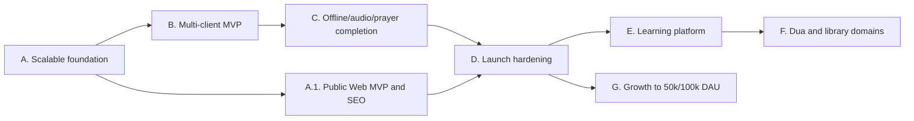

# План и roadmap Quran Platform

Дата обновления: 24 августа 2026 года

Roadmap объединяет развитие клиентов, функциональных доменов и производительности. Текущий
статус реализации по P0 остаётся в [MVP gap audit](mvp-gap-audit.md), а архитектурные правила —
в [документе масштабирования](architecture-and-scaling.md).

## Текущий release verdict для web

Функциональный web-клиент готов для закрытой beta/staging-проверки: production build,
ESLint, TypeScript и 37 Playwright-сценариев проходят. Это ещё не означает готовность
публичного индексируемого production-MVP:

- текущие публичные страницы получают основной Quran/audio-контент после hydration, а не
  отдают его как полноценный server-rendered/ISR HTML;
- locale-prefixed RU/EN/AR/TR routes, legacy redirects, canonical/hreflang, `robots.txt`,
  sitemap, page-specific metadata, manifest и social preview уже добавлены;
- юридические страницы, глубокие маршруты сур/аятов/чтецов, server-rendered Quran content и
  полный Lighthouse/SEO gate ещё не закрыты;
- домен/TLS, внешний мониторинг, offsite backup и обязательные контентные sign-off остаются
  открытыми release gates;
- capacity/soak test ещё не даёт права обещать конкретное количество одновременных
  пользователей.

Поэтому закрытая web beta и публичный Web MVP являются двумя разными milestones. Публичный
запуск web не ждёт Flutter и Telegram Mini App, но и не закрывает полный multi-client MVP.

## Принципы планирования

- для полного multi-client MVP сначала закрывается сквозной сценарий на всех обязательных
  клиентах, затем расширяется количество функций; отдельный публичный Web MVP имеет
  собственный release gate и не подменяет этот критерий;
- инфраструктура оплачивается по текущей нагрузке, но каждый этап сохраняет точки
  горизонтального масштабирования;
- точность, лицензии и редакционный review религиозного контента являются release gate;
- новые домены подключаются отдельно и не усложняют Quran-модели;
- общий API/OpenAPI и sync protocol важнее буквального повторного использования UI;
- переход к следующему профилю мощности выполняется по capacity test и production-метрикам.

## Зависимости этапов

## Этап A. Масштабируемый production foundation

Цель: устранить дорогие для поздней миграции ограничения, не увеличивая стартовые серверы.

- [ ] Выбрать object storage/CDN и оформить ADR с Range/CORS/ETag contract.
- [ ] Перенести managed media с локального диска на immutable object keys.
- [ ] Разделить логический audio track и bitrate/codec renditions.
- [ ] Добавить edge-cache публичных Quran/audio/library API без `Authorization`.
- [ ] Подготовить PgBouncer-compatible DB configuration и connection budget.
- [ ] Разделить конфигурационные URL Redis roles с сохранением одного экземпляра на старте.
- [ ] Сделать web/API/workers stateless и независимо реплицируемыми; Beat — singleton.
- [ ] Добавить API/DB/Redis/Celery/CDN/egress dashboards и budget alerts.
- [ ] Расширить load harness: public/auth/sync, cache-cold/warm и audio Range.
- [ ] Зафиксировать S0/S1 capacity report и runbook перехода к нескольким репликам.

Критерий выхода: потеря application-host не уничтожает media; добавление API/worker-реплики
не требует изменения кода или копирования локального состояния; S1 нагрузка подтверждена.

## Этап A.1. Публичный Web MVP и SEO

Цель: превратить работающий web-preview в публичный, индексируемый и наблюдаемый продукт,
не блокируя этот релиз отсутствующими Flutter и Telegram Mini App.

### Индексируемая архитектура

- [x] Ввести стабильные locale-prefixed URL для RU/EN/AR/TR и определить redirect policy для
  старых URL и query parameters.
- [ ] Создать отдельные индексируемые маршруты главной, списка сур, суры/аята, списка чтецов
  и чтеца/декламации; интерактивный плеер оставить client island.
- [ ] Перенести первичную загрузку публичного Quran/audio-контента в Server Components с
  SSR/ISR, чтобы основной текст и ссылки присутствовали в HTML без JavaScript.
- [x] Добавить `metadataBase`, уникальные title/description, canonical, hreflang для всех
  опубликованных языков, Open Graph/Twitter metadata и preview images.
- [x] Добавить локализованные sitemap и `robots.txt` для текущего набора публичных разделов.
- [ ] Добавить versioned content sitemap index и автоматическую проверку, что только
  опубликованные суры/чтецы/content versions попадают в content sitemaps.
- [x] Явно установить `noindex, nofollow` для login/register/profile и других персональных или
  технических страниц.
- [ ] Определить ISR/edge-cache policy и invalidation по content version; персональные ответы
  оставить `private, no-store`.
- [ ] Добавить только уместные structured data: `WebSite`, breadcrumbs и `AudioObject` для
  опубликованных лицензированных записей.

### Публичная поверхность продукта

- [x] Удалить из пользовательского UI backend liveness/readiness KPI и ссылки на `localhost`;
  технические endpoints оставить в операционном контуре.
- [ ] Добавить Privacy Policy, Terms, контакты/feedback, сведения об источниках и лицензиях.
- [x] Добавить app icon, web manifest и social preview assets.
- [ ] Добавить корректную пользовательскую 404/500 поверхность.
- [x] Сделать заголовок каждой страницы её основным `h1`, сохранив название продукта в
  header как навигационный brand element.

### Web launch gates

- [ ] Развернуть staging и production на публичном домене с TLS, redirects HTTP→HTTPS,
  security headers и проверенной proxy-конфигурацией.
- [ ] Подключить внешний uptime/error monitoring, dashboards/alerts и offsite backup с
  проверенным restore.
- [x] Добавить SEO/metadata/robots/sitemap regression tests.
- [ ] Добавить Lighthouse budgets для ключевых шаблонов RU/EN/AR/TR и RTL.
- [ ] Прогнать browser E2E против production build и интеграционный smoke против реального
  staging API; mocked contract tests сохранить как быстрый CI-слой.
- [ ] Получить актуальный зелёный dependency/security gate на release commit.
- [ ] Провести capacity/soak test web workload mix и записать доказанную ёмкость S0/S1;
  до этого не публиковать числовую гарантию по concurrent users.
- [ ] Получить religious/editorial, license/legal и product sign-off для активируемого Quran
  dataset и каждого публичного аудиорелиза.
- [ ] После deployment проверить Search Console/Webmaster Tools, отправку sitemap, canonical,
  hreflang, отсутствие индексирования приватных маршрутов и реальные Core Web Vitals.

Критерий выхода: ключевые публичные страницы отдают содержательный HTML без JavaScript,
имеют стабильные canonical/locale URL и проходят SEO regression; приватные маршруты исключены
из индекса; домен/TLS, monitoring, offsite restore, security gate, capacity report и контентные
sign-off подтверждены. После этого web можно обозначить как публичный production-MVP, но полный
multi-client MVP остаётся на этапах B–D.

## Этап B. Multi-client MVP

Цель: один backend обслуживает Flutter, web и Telegram Mini App без расхождения контрактов.

- [ ] Создать Flutter workspace: generated API client, secure storage, local DB, auth/device
  lifecycle, offline repository и durable outbox.
- [ ] Реализовать Flutter Mushaf reader, bookmarks и cross-device sync.
- [ ] Создать отдельный Telegram Mini App shell/deployment с проверкой `initData`, theme/safe
  area adapters, deep links и связыванием identity.
- [ ] Включить OpenAPI breaking-change gate и генерацию Dart/TypeScript SDK.
- [ ] Добавить client capability matrix и contract tests для всех трёх клиентов.
- [ ] Довести RU/EN/AR/TR и RTL parity до Flutter и Telegram Mini App.

Критерий выхода: гость начинает на любом клиенте, безопасно связывает аккаунт и продолжает
чтение на другом устройстве без потери позиции, закладок и outbox.

## Этап C. Завершение Quran/audio/prayer P0

- [ ] Offline package domain, manifests, resume/checksum и quota/eviction policy.
- [ ] Flutter background audio, audio focus, lock-screen controls и восстановление очереди.
- [ ] Несколько лицензированных чтецов и проверенные bitrate renditions.
- [ ] Playback state sync при сохранении device-local очереди.
- [ ] Flutter local prayer calculation и notification scheduler с timezone/location reschedule.
- [ ] Translation/tafsir placeholder schema/API/UI.
- [ ] Reading sessions, goals и streaks.
- [ ] Editorial approvals, safe feedback attachments и user notifications.

Критерий выхода: основные Quran-сценарии полезны offline на Flutter, web и Telegram Mini App
корректно деградируют в пределах своих платформ, content acceptance пройден.

## Этап D. Launch hardening

Этот этап повторяет и расширяет web launch gates для полного multi-client релиза, включая
Flutter и Telegram Mini App; уже закрытые проверки не отменяются, а подтверждаются на общем
client workload mix.

- [ ] Security/privacy review, SAST/SCA/container scan и threat-model update.
- [ ] Dashboards, alerts, on-call ownership и runbooks DB/Redis/CDN/provider failure.
- [ ] Offsite backup, PITR и измеренный restore drill.
- [ ] Capacity/soak tests для реального client workload mix.
- [ ] Accessibility, RTL, browser/device/Telegram matrix.
- [ ] License, product и религиозно-редакционный sign-off.
- [ ] Canary release и rollback evidence.

## Этап E. Обучение и карточки

P1-этап начинается после готовности и запуска P0; он не блокирует первый релиз.

Цель: добавить обучение без изменения канонического Quran-домена.

- [ ] Создать домен `memorization`: deck, card template, review schedule, attempt и progress.
- [ ] Поддержать карточки слов, аятов и диапазонов через versioned content references.
- [ ] Зафиксировать источники морфологии/переводов и отдельный редакционный sign-off.
- [ ] Реализовать интервальное повторение как версионированную стратегию, а не скрытую
  бизнес-логику клиента.
- [ ] Добавить offline review queue Flutter и синхронизацию конфликтов.
- [ ] Добавить web/TMA review flow с ограниченной offline-поддержкой.
- [ ] Ввести агрегаты прогресса без публичных рейтингов и поведенческого профилирования.

Критерий выхода: изменение алгоритма повторения или источника текста создаёт новую версию и
не повреждает историю пользователя; карточки работают на всех клиентах согласно capability
matrix.

## Этап F. Дуа и расширяемая библиотека

- [ ] Реализовать отдельный домен `dua`: collections, entries, sources, translations,
  categories, publication и withdrawal.
- [ ] Добавить bookmarks/collections/offline manifests для дуа через типизированные ссылки.
- [ ] Создать `library` как read-model витрину, а не универсальное хранилище контента.
- [ ] Добавить поиск с domain filters, locale и versioned index.
- [ ] Подключать хадисы, книги и образовательные подборки отдельными доменами по тому же
  extension contract.
- [ ] Видео вводить только после CDN/rights/cost spike.

Критерий выхода: новый тип контента можно добавить без миграции Quran/audio таблиц и без
breaking change существующих клиентов.

## Этап G. Рост мощности

### S1: запуск до 10 000 DAU

- managed PostgreSQL/Redis, object storage/CDN;
- одна или две небольшие API/web replicas по SLO;
- подтверждённый пик до 300 origin API RPS;
- media egress и стоимость на DAU видны ежедневно.

### S2: рост до 50 000 DAU

- autoscaling API и workers;
- PgBouncer и формальный connection budget;
- разделение Redis cache/throttle и Celery по измеренной необходимости;
- оптимизация/партиционирование самых быстрорастущих журналов;
- регулярный load/soak test перед крупными релизами.

### S3: целевой профиль до 100 000 DAU

- multi-AZ application replicas и PostgreSQL HA;
- проверочная модель до 1 500 peak origin API RPS;
- до 5 000 одновременных managed audio sessions через CDN;
- selective read replicas/partitioning только после доказанной saturation;
- cost, SLO и DR review перед каждым увеличением постоянного minimum capacity.

## Не включать преждевременно

- микросервис на каждый тип контента;
- Kubernetes без эксплуатационной необходимости;
- active-active multi-region;
- собственный audio proxy;
- read replicas и постоянную мощность под S3 до подтверждённой нагрузки;
- социальную ленту, рейтинги и голосовое распознавание раньше базовых learning/library flows.
