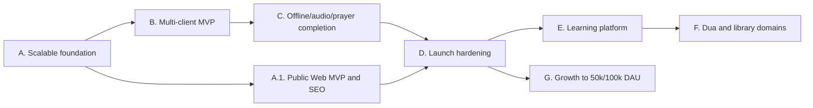

# План и roadmap Quran Platform

Дата обновления: 25 августа 2026 года

Roadmap объединяет развитие клиентов, функциональных доменов и производительности. Текущий
статус реализации по P0 остаётся в [MVP gap audit](mvp-gap-audit.md), а архитектурные правила —
в [документе масштабирования](architecture-and-scaling.md).

## Текущий release verdict для web

Функциональный web-клиент готов для закрытой beta/staging-проверки: production build,
ESLint, TypeScript и 47 Playwright-сценариев проходят как на dev server, так и на standalone
production bundle. Это ещё не означает готовность
публичного индексируемого production-MVP:

- каталог и страницы опубликованных сур/аятов, чтецов и декламаций уже отдают содержательный
  server-rendered HTML; интерактивные reader и audio player остаются client surfaces;
- locale-prefixed RU/EN/AR/TR routes, legacy redirects, canonical/hreflang, `robots.txt`,
  sitemap, page-specific metadata, manifest и social preview уже добавлены;
- Lighthouse/SEO regression gate для RU/EN/AR/TR, арабского RTL и опубликованной суры
  закрыт; field Core Web Vitals и финальный legal/license/religious sign-off проверяются
  после deployment;
- staging-домен/TLS, noindex, локальный backup/restore drill и budget deployment уже проверены;
  внешний мониторинг, offsite backup и обязательные контентные sign-off остаются открытыми
  release gates;
- pre-publication public-read workload прошёл на бюджетном CX23 при 14 непрерывно активных
  виртуальных пользователях; [evidence](capacity/staging-cx23-prepublication-2026-08-25.md)
  не включает Quran corpus и R2 audio, поэтому не является S0/S1 или DAU-гарантией.

Поэтому закрытая web beta и публичный Web MVP являются двумя разными milestones. Публичный
запуск web не ждёт Flutter и Telegram Mini App, но и не закрывает полный multi-client MVP.

## Принципы планирования

- для полного multi-client MVP сначала закрывается сквозной сценарий на всех обязательных
  клиентах, затем расширяется количество функций; отдельный публичный Web MVP имеет
  собственный release gate и не подменяет этот критерий;
- инфраструктура оплачивается по текущей нагрузке, но каждый этап сохраняет точки
  горизонтального масштабирования;
- точность, лицензии и редакционный review религиозного контента являются release gate;
- новые домены подключаются отдельно и не усложняют Quran-модели;
- общий API/OpenAPI и sync protocol важнее буквального повторного использования UI;
- переход к следующему профилю мощности выполняется по capacity test и production-метрикам.

## Зависимости этапов

## Этап A. Масштабируемый production foundation

Цель: устранить дорогие для поздней миграции ограничения, не увеличивая стартовые серверы.

- [x] Выбрать Cloudflare R2 Standard + CDN custom domain как pay-as-you-go стартовый provider,
  оформить переносимый S3-compatible [ADR](adr/0001-managed-media-object-storage-cdn.md) и
  bounded автоматическую проверку Range/CORS/ETag/cache contract.
- [x] Убрать production runtime-зависимость от локального media-диска: provider-neutral
  S3 adapter выполняет create-only upload с SHA-256/metadata/HEAD verification, команды аудио
  и Мусхафа используют immutable keys, а gateway больше не раздаёт `/media/`.
- [x] Подготовить воспроизводимый staging bootstrap поверх production topology: отдельные
  secrets/data, Caddy automatic HTTPS, noindex/robots isolation, закрытый Mailpit, безопасная
  R2 credential/CORS настройка, preflight, backup/observability Make-команды и пошаговый
  [runbook](staging.md). Отдельный budget overlay поддерживает функциональный staging на
  2 vCPU/4 GiB. Бюджетный Hetzner CX23, `staging.iqro.forum`, TLS, отдельный R2 bucket,
  backup/restore drill и pre-publication capacity evidence фактически проверены; production
  media domain, offsite backup и production-sized observability/capacity gates остаются открыты.
- [ ] Provision production R2 bucket/custom domain/CORS, загрузить реальные versioned assets,
  приложить CDN contract reports и провести restore/inventory drill; покупать media-серверы
  заранее не требуется.
- [x] Разделить логический `AudioTrack`/таймлайн и физические `AudioRendition` вариантов
  economy/standard/high; backfill существующих assets обратим, API сохраняет совместимый
  default `asset` и отдаёт типизированный список renditions.
- [ ] Добавить edge-cache публичных Quran/audio/library API без `Authorization`.
- [x] Подготовить PgBouncer-compatible DB configuration и connection budget: ASGI не держит
  persistent connections, transaction mode отключает server-side cursors/автоподготовку
  statements, а startup и operator-команда отклоняют превышение PostgreSQL/client pool budget.
- [x] Разделить Redis roles: default cache и atomic throttling используют разные Django aliases,
  Celery broker/result имеют независимые URL, startup валидирует endpoints, а S0 сохраняет один
  экземпляр Redis через одинаковые role URLs.
- [x] Сделать API/workers stateless и независимо реплицируемыми: runtime не использует
  локальные media/schedule-файлы, worker prefetch управляется конфигурацией, а Beat защищён
  token-safe Redis lease и прекращает работу при его потере.
- [ ] Добавить API/DB/Redis/Celery/CDN/egress dashboards и budget alerts: versioned opt-in
  Prometheus/Grafana/Alertmanager baseline, bounded multi-worker API metrics, exporters, S0
  rules и budget rendering готовы; остаются provider CDN/billing/QoE ingestion, внешний uptime,
  production alert routing и доказательство синтетической доставки.
- [ ] Расширить load harness: staged public web/Quran/audio API read workload уже добавлен;
  bounded audio `HEAD`/startup/seek Range harness пишет TTFB/throughput/cache/bytes evidence,
  fail-closed stateful harness покрывает guest auth/token refresh/reading sync push-pull;
  остаются library API, registered-user journey, production-like cache-cold/warm/origin прогоны
  и client startup/buffering QoE.
- [ ] Зафиксировать S0/S1 capacity report и runbook перехода к нескольким репликам;
  [pre-publication CX23 evidence](capacity/staging-cx23-prepublication-2026-08-25.md) уже
  доказывает 14 saturated read clients, но не содержит Quran/audio/sync workload.

Критерий выхода: потеря application-host не уничтожает media; добавление API/web/worker-реплики
не требует изменения кода или копирования локального состояния; S1 нагрузка подтверждена.

## Этап A.1. Публичный Web MVP и SEO

Цель: превратить работающий web-preview в публичный, индексируемый и наблюдаемый продукт,
не блокируя этот релиз отсутствующими Flutter и Telegram Mini App.

### Индексируемая архитектура

- [x] Ввести стабильные locale-prefixed URL для RU/EN/AR/TR и определить redirect policy для
  старых URL и query parameters.
- [x] Добавить глубокие индексируемые ISR-маршруты опубликованной суры и отдельного аята;
  интерактивный reader оставить отдельной client surface.
- [x] Создать server-rendered список сур, список чтецов и маршрут чтеца/декламации;
  интерактивный плеер оставить client island.
- [x] Отдавать основной текст и ссылки опубликованной суры/аята в Server Components без
  зависимости от JavaScript.
- [x] Перенести опубликованный список чтецов, метаданные декламации и список треков в
  Server Components с hourly data cache/ISR; прямые media URL не включать в HTML.
- [x] Добавить `metadataBase`, уникальные title/description, canonical, hreflang для всех
  опубликованных языков, Open Graph/Twitter metadata и preview images.
- [x] Добавить локализованные sitemap и `robots.txt` для текущего набора публичных разделов.
- [x] Добавить versioned Quran content sitemap index и автоматическую проверку, что только
  активные опубликованные edition/content version, суры и аяты попадают в sitemap.
- [x] Добавить опубликованных чтецов/декламации в отдельный versioned audio sitemap,
  отсекающий withdrawn, non-streaming, incomplete и stale-version releases через public API.
- [x] Явно установить `noindex, nofollow` для login/register/profile и других персональных или
  технических страниц.
- [x] Определить ISR policy и автоматическую invalidation по content version через защищённое
  backend → Celery → web событие; персональные ответы оставить `private, no-store`, а gateway
  не должен независимо кэшировать HTML/RSC/JSON до появления CDN purge adapter.
- [x] Подключить общий Redis-backed Next.js cache handler для fetch/ISR/route entries и
  распределённые tag timestamps через `updateTags`/`getExpiration`; production без общего
  cache URL запускается fail-closed, а dev/build сохраняют memory fallback.
- [ ] При edge-cache HTML/RSC/public JSON добавить purge adapter к publication event; до этого
  gateway/CDN не должны независимо кэшировать эти ответы.
- [x] Добавить `BreadcrumbList` для глубоких маршрутов сур и аятов.
- [x] Добавить `WebSite` и `AudioObject` только для опубликованных лицензированных записей,
  не раскрывая прямые media URL в server-rendered HTML.

### Публичная поверхность продукта

- [x] Удалить из пользовательского UI backend liveness/readiness KPI и ссылки на `localhost`;
  технические endpoints оставить в операционном контуре.
- [x] Добавить локализованные Privacy Policy, Terms, контакты/feedback и динамические сведения
  об источниках/лицензиях; production требует реальное имя и адрес оператора, юридическую
  юрисдикцию и рабочие legal/security email из secret/config store.
- [x] Добавить app icon, web manifest и social preview assets.
- [x] Добавить локализованную пользовательскую 404, route error boundary с retry и
  независимый global 500 fallback без раскрытия серверной ошибки.
- [x] Сделать заголовок каждой страницы её основным `h1`, сохранив название продукта в
  header как навигационный brand element.

### Web launch gates

- [ ] Развернуть staging и production на публичном домене с TLS, redirects HTTP→HTTPS,
  и проверенной proxy-конфигурацией. Repo-side staging overlay/generator/preflight/runbook готовы;
  остаются фактический VPS, DNS, R2 и runtime evidence.
- [x] Добавить defense-in-depth security headers в Next.js и gateway: CSP без `unsafe-eval`
  в production, clickjacking/MIME/referrer/permissions policy и HSTS; отдельный Telegram Mini
  App origin должен получить собственный `frame-ancestors`, а не ослаблять web policy.
- [ ] Подключить внешний uptime/error monitoring, dashboards/alerts и offsite backup с
  проверенным restore.
- [x] Добавить SEO/metadata/robots/sitemap regression tests.
- [x] Добавить блокирующие Lighthouse budgets для landing RU/EN/AR/TR и опубликованной суры
  RU/AR, включая проверку `lang`/`dir`, RTL, performance/a11y/best-practices/SEO, Web Vitals,
  transfer size и request count на standalone production build.
- [ ] Browser E2E против standalone production build уже является блокирующим CI-слоем и
  проходит те же 47 сценариев, что быстрый dev/mock слой. Реальный staging smoke подтвердил
  RU/EN/AR/TR locale metadata, Quran shell, EN/TR audio/prayer/login/404, canonical,
  RTL/noindex и sitemap без mock contracts; content-backed journey остаётся до активации
  согласованного dataset.
- [ ] Получить актуальный зелёный dependency/security gate на release commit; backend
  `pip-audit`, полный web `npm audit` и Trivy-проверка всех пяти production-образов уже
  являются блокирующими CI checks, но итоговый checkbox закрывается только на самом release
  commit после GitHub CI.
- [ ] Провести staged public-read capacity/soak test на production-like staging и записать
  доказанную ёмкость S0/S1. На budget CX23 сохранён
  [pre-publication отчёт](capacity/staging-cx23-prepublication-2026-08-25.md): 14 saturated
  clients прошли пятиминутный soak, 16 уже превысили latency gate; полный gate ждёт
  опубликованную суру, R2 audio и sync workload.
- [ ] Получить religious/editorial, license/legal и product sign-off для активируемого Quran
  dataset и каждого публичного аудиорелиза.
- [ ] После deployment проверить Search Console/Webmaster Tools, отправку sitemap, canonical,
  hreflang, отсутствие индексирования приватных маршрутов и реальные Core Web Vitals.

Критерий выхода: ключевые публичные страницы отдают содержательный HTML без JavaScript,
имеют стабильные canonical/locale URL и проходят SEO regression; приватные маршруты исключены
из индекса; домен/TLS, monitoring, offsite restore, security gate, capacity report и контентные
sign-off подтверждены. После этого web можно обозначить как публичный production-MVP, но полный
multi-client MVP остаётся на этапах B–D.

## Этап B. Multi-client MVP

Цель: один backend обслуживает Flutter, web и Telegram Mini App без расхождения контрактов.

- [ ] Создать Flutter workspace: generated API client, secure storage, local DB, auth/device
  lifecycle, offline repository и durable outbox.
- [ ] Реализовать Flutter Mushaf reader, bookmarks и cross-device sync.
- [ ] Создать отдельный Telegram Mini App shell/deployment с проверкой `initData`, theme/safe
  area adapters, deep links и связыванием identity.
- [ ] Включить OpenAPI breaking-change gate и генерацию Dart/TypeScript SDK.
- [ ] Добавить client capability matrix и contract tests для всех трёх клиентов.
- [ ] Довести RU/EN/AR/TR и RTL parity до Flutter и Telegram Mini App.

Критерий выхода: гость начинает на любом клиенте, безопасно связывает аккаунт и продолжает
чтение на другом устройстве без потери позиции, закладок и outbox.

## Этап C. Завершение Quran/audio/prayer P0

- [ ] Offline package domain, manifests, resume/checksum и quota/eviction policy.
- [ ] Flutter background audio, audio focus, lock-screen controls и восстановление очереди.
- [ ] Несколько лицензированных чтецов и проверенные bitrate renditions.
- [ ] Playback state sync при сохранении device-local очереди.
- [ ] Flutter local prayer calculation и notification scheduler с timezone/location reschedule.
- [ ] Translation/tafsir placeholder schema/API/UI.
- [ ] Reading sessions, goals и streaks.
- [ ] Editorial approvals, safe feedback attachments и user notifications.

Критерий выхода: основные Quran-сценарии полезны offline на Flutter, web и Telegram Mini App
корректно деградируют в пределах своих платформ, content acceptance пройден.

## Этап D. Launch hardening

Этот этап повторяет и расширяет web launch gates для полного multi-client релиза, включая
Flutter и Telegram Mini App; уже закрытые проверки не отменяются, а подтверждаются на общем
client workload mix.

- [ ] Security/privacy review, SAST/SCA/container scan и threat-model update.
- [ ] Dashboards, alerts, on-call ownership и runbooks DB/Redis/CDN/provider failure.
- [ ] Offsite backup, PITR и измеренный restore drill.
- [ ] Capacity/soak tests для реального client workload mix.
- [ ] Accessibility, RTL, browser/device/Telegram matrix.
- [ ] License, product и религиозно-редакционный sign-off.
- [ ] Canary release и rollback evidence.

## Этап E. Обучение и карточки

P1-этап начинается после готовности и запуска P0; он не блокирует первый релиз.

Цель: добавить обучение без изменения канонического Quran-домена.

- [ ] Создать домен `memorization`: deck, card template, review schedule, attempt и progress.
- [ ] Поддержать карточки слов, аятов и диапазонов через versioned content references.
- [ ] Зафиксировать источники морфологии/переводов и отдельный редакционный sign-off.
- [ ] Реализовать интервальное повторение как версионированную стратегию, а не скрытую
  бизнес-логику клиента.
- [ ] Добавить offline review queue Flutter и синхронизацию конфликтов.
- [ ] Добавить web/TMA review flow с ограниченной offline-поддержкой.
- [ ] Ввести агрегаты прогресса без публичных рейтингов и поведенческого профилирования.

Критерий выхода: изменение алгоритма повторения или источника текста создаёт новую версию и
не повреждает историю пользователя; карточки работают на всех клиентах согласно capability
matrix.

## Этап F. Дуа и расширяемая библиотека

- [ ] Реализовать отдельный домен `dua`: collections, entries, sources, translations,
  categories, publication и withdrawal.
- [ ] Добавить bookmarks/collections/offline manifests для дуа через типизированные ссылки.
- [ ] Создать `library` как read-model витрину, а не универсальное хранилище контента.
- [ ] Добавить поиск с domain filters, locale и versioned index.
- [ ] Подключать хадисы, книги и образовательные подборки отдельными доменами по тому же
  extension contract.
- [ ] Видео вводить только после CDN/rights/cost spike.

Критерий выхода: новый тип контента можно добавить без миграции Quran/audio таблиц и без
breaking change существующих клиентов.

## Этап G. Рост мощности

### S1: запуск до 10 000 DAU

- managed PostgreSQL/Redis, object storage/CDN;
- одна или две небольшие API/web replicas по SLO;
- подтверждённый пик до 300 origin API RPS;
- media egress и стоимость на DAU видны ежедневно.

### S2: рост до 50 000 DAU

- autoscaling API и workers;
- PgBouncer и формальный connection budget;
- разделение Redis cache/throttle и Celery по измеренной необходимости;
- оптимизация/партиционирование самых быстрорастущих журналов;
- регулярный load/soak test перед крупными релизами.

### S3: целевой профиль до 100 000 DAU

- multi-AZ application replicas и PostgreSQL HA;
- проверочная модель до 1 500 peak origin API RPS;
- до 5 000 одновременных managed audio sessions через CDN;
- selective read replicas/partitioning только после доказанной saturation;
- cost, SLO и DR review перед каждым увеличением постоянного minimum capacity.

## Не включать преждевременно

- микросервис на каждый тип контента;
- Kubernetes без эксплуатационной необходимости;
- active-active multi-region;
- собственный audio proxy;
- read replicas и постоянную мощность под S3 до подтверждённой нагрузки;
- социальную ленту, рейтинги и голосовое распознавание раньше базовых learning/library flows.
