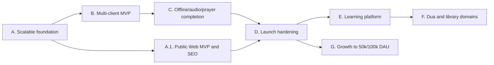

# План и roadmap Quran Platform

Дата обновления: 29 августа 2026 года

Roadmap объединяет развитие клиентов, функциональных доменов и производительности. Текущий
статус реализации по P0 остаётся в [MVP gap audit](mvp-gap-audit.md), а архитектурные правила —
в [документе масштабирования](architecture-and-scaling.md). Простая сводка всех фактических
capacity-прогонов, оценка стартового DAU и пороги апгрейда собраны в
[итоговом отчёте CX23](capacity/staging-cx23-executive-summary-2026-08-25.md).

## Текущий release verdict для web

Функциональный web-клиент готов для закрытой beta/staging-проверки: production build,
ESLint, TypeScript и 80 Playwright-сценариев доступны в одном regression-наборе для dev server
и standalone
production bundle. Это ещё не означает готовность
публичного индексируемого production-MVP:

- каталог и страницы опубликованных сур/аятов, чтецов и декламаций уже отдают содержательный
  server-rendered HTML; интерактивные reader и audio player остаются client surfaces;
- locale-prefixed RU/EN/AR/TR routes, legacy redirects, canonical/hreflang, `robots.txt`,
  sitemap, page-specific metadata, manifest и social preview уже добавлены;
- Lighthouse/SEO regression gate для RU/EN/AR/TR, арабского RTL и опубликованной суры
  закрыт; field Core Web Vitals и финальный legal/license/religious sign-off проверяются
  после deployment;
- staging-домен/TLS, noindex, локальный backup/restore drill и budget deployment уже проверены;
  provider-neutral offsite upload/full-download/restore pipeline и лёгкий dead-man heartbeat
  добавлены, но внешний monitor URL, отдельный приватный backup bucket/token и обязательные
  контентные sign-off остаются открытыми
  release gates;
- strict budget Quran read workload прошёл на CX23 при 10 непрерывно активных saturated
  клиентах: 4 612 запросов за две минуты, 0% ошибок, p95 682 ms; 12 клиентов превысили p95;
  [evidence](capacity/staging-cx23-quran-budget-2026-08-25.md). Synthetic warm R2 audio
  подтвердил 25 playback-клиентов и деградацию с 30. Изолированный guest auth/reading sync
  профиль подтвердил 8 постоянно активных stateful-клиентов и выход за p95 на 10;
  [evidence](capacity/staging-cx23-stateful-sync-2026-08-25.md). Realistic mixed workload
  подтвердил `20 readers + 4 sync users` без ошибок;
  [evidence](capacity/staging-cx23-mixed-realistic-2026-08-25.md). Реальный audio release,
  production-sized multi-region прогон и real audio ещё не закрыты. Новый registered email
  account + sync подтвердил 4 active users, а 6/8 превысили latency gate;
  [evidence](capacity/staging-cx23-registered-user-2026-08-25.md). Existing-account merge и
  multi-device identity journey остаются. Для ускоренного ограниченного Web MVP владелец
  решил не продолжать полный load/soak цикл до релиза: уже собранные S0 evidence принимаются
  как нижняя проверенная граница, а дополнительные performance-прогоны перенесены после MVP.
  Обязательные content/security/backup/monitoring gates не снимаются; решение и стоп-условия
  зафиксированы в [fast-track release plan](release/web-mvp-fast-track-2026-08-25.md).

Поэтому закрытая web beta и публичный Web MVP являются двумя разными milestones. Публичный
запуск web не ждёт Flutter и Telegram Mini App, но и не закрывает полный multi-client MVP.

## Принципы планирования

- для полного multi-client MVP сначала закрывается сквозной сценарий на всех обязательных
  клиентах, затем расширяется количество функций; отдельный публичный Web MVP имеет
  собственный release gate и не подменяет этот критерий;
- инфраструктура оплачивается по текущей нагрузке, но каждый этап сохраняет точки
  горизонтального масштабирования;
- точность, лицензии и редакционный review религиозного контента являются release gate;
- целевой каталог включает все официально доступные и разрешённые мусхафы/риваяты, чтецов,
  переводы, тафсиры и связанные ресурсы; обнаружение ресурса не равно автоматической
  публикации — новые позиции сначала поступают в `draft`;
- новые домены подключаются отдельно и не усложняют Quran-модели;
- общий API/OpenAPI и sync protocol важнее буквального повторного использования UI;
- переход к следующему профилю мощности выполняется по capacity test и production-метрикам.

## Зависимости этапов

## Этап A. Масштабируемый production foundation

Цель: устранить дорогие для поздней миграции ограничения, не увеличивая стартовые серверы.

- [x] Выбрать Cloudflare R2 Standard + CDN custom domain как pay-as-you-go стартовый provider,
  оформить переносимый S3-compatible [ADR](adr/0001-managed-media-object-storage-cdn.md) и
  bounded автоматическую проверку Range/CORS/ETag/cache contract.
- [x] Убрать production runtime-зависимость от локального media-диска: provider-neutral
  S3 adapter выполняет create-only upload с SHA-256/metadata/HEAD verification, команды аудио
  и Мусхафа используют immutable keys, а gateway больше не раздаёт `/media/`.
- [x] Подготовить воспроизводимый staging bootstrap поверх production topology: отдельные
  secrets/data, Caddy automatic HTTPS, noindex/robots isolation, закрытый Mailpit, безопасная
  R2 credential/CORS настройка, preflight, backup/observability Make-команды и пошаговый
  [runbook](staging.md). Отдельный budget overlay поддерживает функциональный staging на
  2 vCPU/4 GiB. Бюджетный Hetzner CX23, `staging.iqro.forum`, TLS, отдельный R2 bucket,
  backup/restore drill и pre-publication capacity evidence фактически проверены; production
  media domain, offsite backup и production-sized observability/capacity gates остаются открыты.
- [x] Завершить staging media edge: bucket `iqro-staging-media`, scoped token, точный CORS,
  делегирование `iqro.forum`, custom domain `media.staging.iqro.forum` и edge TLS активны.
  Бесплатные hostname-scoped cache/security header rules включены, staging env переключён с
  временного `r2.dev`; CDN contract зелёный, повторный Range-запрос подтверждён как cache HIT.
- [x] Реализовать браузерные напоминания о намазе и повторении аятов: opt-in Web Push,
  Service Worker, VAPID, privacy-safe device subscription, отдельный consent на округлённую
  геолокацию для ежедневного серверного расчёта пяти намазов, локализованный deep link,
  indexed due queue с claim/retry и горизонтально масштабируемые Celery workers. Полностью
  offline-доставка без сети остаётся задачей native mobile scheduler.
- [x] Подключить существующий Quran.Foundation production API-доступ без раскрытия credentials.
  Стандартные Developer Terms приняты как достаточное разрешение для first-party streaming;
  отдельный ответ по email не является release gate. Production-каталог содержит 21 Hafs
  chapter-reciter и 12 ayah-by-ayah resources. Полный проход всех 114 сур опубликовал 18
  валидных chapter-reciter; resources `161`, `168` и `173` fail-closed исключены из-за
  некорректных upstream-таймкодов. Отдельный ayah-by-ayah каталог синхронизирован полностью:
  12/12 sources, 1 368 chapter groups и 74 832 внешних MP3 URL; 24 bounded CDN-пробы успешны.
  Bounded probe подтвердил Range delivery и выявил metadata size drift у source `7`; importer
  всегда сверяет реальный `Content-Length`. Полный импорт выбирает каталог автоматически,
  поддерживает resume и хранит только streaming URL. Все четыре доступных QF Mushaf resource
  (`1`, `5`, `11`, `19`) синхронизируются официальным Content Sync: локальный bootstrap
  сохранил 2 416 страниц и 334 660 позиционированных слов, повторный checkpoint-sync не
  скачивает snapshot повторно. Web reader подключён к трём безопасно отображаемым вариантам:
  QCF V2, KFGQPC Hafs и QCF V4 Tajweed; локальный scan остаётся четвёртым вариантом, а ID `11`
  fail-closed скрыт. [Audio evidence](capacity/staging-qf-real-audio-2026-08-25.md),
  [license decision](sign-offs/quran-foundation-audio-license-decision-2026-08-25.md),
  [full-catalog evidence](capacity/quran-foundation-production-catalog-2026-08-25.md).
- [ ] Provision production R2 bucket/custom domain/CORS, загрузить реальные versioned assets,
  приложить CDN contract reports и провести restore/inventory drill; покупать media-серверы
  заранее не требуется.
- [x] Разделить логический `AudioTrack`/таймлайн и физические `AudioRendition` вариантов
  economy/standard/high; backfill существующих assets обратим, API сохраняет совместимый
  default `asset` и отдаёт типизированный список renditions.
- [x] Добавить bounded edge-cache текущих публичных Quran/audio/prayer catalog API: gateway
  кэширует только ответы с явным `public` без cookie/`Authorization`, различает Origin/Accept,
  а publication event после web revalidation выполняет защищённый wildcard purge.
- [ ] При реализации `library` расширить типизированный publication event и его contract tests;
  gateway route prefix уже зарезервирован, но не считается рабочим до появления самого домена.
- [x] Подготовить PgBouncer-compatible DB configuration и connection budget: ASGI не держит
  persistent connections, transaction mode отключает server-side cursors/автоподготовку
  statements, а startup и operator-команда отклоняют превышение PostgreSQL/client pool budget.
- [x] Разделить Redis roles: default cache и atomic throttling используют разные Django aliases,
  Celery broker/result имеют независимые URL, startup валидирует endpoints, а S0 сохраняет один
  экземпляр Redis через одинаковые role URLs.
- [x] Сделать API/workers stateless и независимо реплицируемыми: runtime не использует
  локальные media/schedule-файлы, worker prefetch управляется конфигурацией, а Beat защищён
  token-safe Redis lease и прекращает работу при его потере.
- [ ] Добавить API/DB/Redis/Celery/CDN/egress dashboards и budget alerts: versioned opt-in
  Prometheus/Grafana/Alertmanager baseline, bounded multi-worker API metrics, exporters, S0
  rules и budget rendering готовы; остаются provider CDN/billing/QoE ingestion, внешний uptime,
  production alert routing и доказательство синтетической доставки.
- [ ] **Post-MVP:** расширить load harness: staged public web/Quran/audio API read workload уже добавлен;
  bounded audio `HEAD`/startup/seek Range harness пишет TTFB/throughput/cache/bytes evidence,
  fail-closed stateful harness покрывает guest auth/token refresh/reading sync push-pull;
  gateway cache regression на CX23 прошёл 200 запросов при concurrency 10 без ошибок и
  подтвердил `MISS/HIT/BYPASS/PURGE`; synthetic warm R2 audio прогон подтвердил 25 playback
  clients и отсутствие audio egress через VPS. Изолированный stateful-прогон на том же CX23
  подтвердил guest auth/token refresh/reading sync при 8 постоянно активных клиентах, а 10
  превысили p95 gate. Mixed harness и изолированный прогон подтвердили `20 readers + 4 sync
  users`. Registered harness подтвердил 4 new-account active users и boundary на 6/8. Bounded
  real-audio probe подтвердил startup/seek delivery 3/3 внешних QF assets и metadata consistency
  2/3. Полный multi-surah performance/soak, library API, existing-account merge/multi-device
  journey, client startup/buffering QoE и production-controlled cache-cold/warm/origin
  осознанно перенесены после ограниченного Web MVP; content-integrity validation не считается
  нагрузочным тестом и остаётся обязательной перед публикацией.
- [ ] **Post-MVP:** зафиксировать полный S0/S1 capacity report и runbook перехода к нескольким репликам;
  [strict budget CX23 evidence](capacity/staging-cx23-quran-budget-2026-08-25.md) уже
  доказывает 10 saturated Quran read clients и boundary на 12, а
  [synthetic audio evidence](capacity/staging-r2-synthetic-audio-2026-08-25.md) — 25 warm-CDN
  playback clients на одном тестовом маршруте; отдельный
  [stateful sync evidence](capacity/staging-cx23-stateful-sync-2026-08-25.md) подтверждает 8
  тяжёлых guest sync-клиентов и latency boundary на 10; отдельный
  [mixed evidence](capacity/staging-cx23-mixed-realistic-2026-08-25.md) — `20 readers + 4 sync
  users`, а [registered evidence](capacity/staging-cx23-registered-user-2026-08-25.md) — 4
  active new-account users с boundary на 6/8. Single-host API/web scale автоматизирован через
  bounded preflight, DB budget и dynamic Docker DNS; временный профиль `2 API + 2 web`
  фактически проверил равномерное API-распределение, service-level failover и возврат к `1+1`
  на CX23. Полный S1 multi-region/real-audio report и внешний load-balancer/HA runbook ещё не
  закрыты.

Критерий выхода: потеря application-host не уничтожает media; добавление API/web/worker-реплики
не требует изменения кода или копирования локального состояния; S1 нагрузка подтверждена.

## Этап A.1. Публичный Web MVP и SEO

Цель: превратить работающий web-preview в публичный, индексируемый и наблюдаемый продукт,
не блокируя этот релиз отсутствующими Flutter и Telegram Mini App.

### Индексируемая архитектура

- [x] Ввести стабильные locale-prefixed URL для RU/EN/AR/TR и определить redirect policy для
  старых URL и query parameters.
- [x] Добавить глубокие индексируемые ISR-маршруты опубликованной суры и отдельного аята;
  интерактивный reader оставить отдельной client surface.
- [x] Создать server-rendered список сур, список чтецов и маршрут чтеца/декламации;
  интерактивный плеер оставить client island.
- [x] Отдавать основной текст и ссылки опубликованной суры/аята в Server Components без
  зависимости от JavaScript.
- [x] Перенести опубликованный список чтецов, метаданные декламации и список треков в
  Server Components с hourly data cache/ISR; прямые media URL не включать в HTML.
- [x] Добавить `metadataBase`, уникальные title/description, canonical, hreflang для всех
  опубликованных языков, Open Graph/Twitter metadata и preview images.
- [x] Добавить локализованные sitemap и `robots.txt` для текущего набора публичных разделов.
- [x] Добавить versioned Quran content sitemap index и автоматическую проверку, что только
  активные опубликованные edition/content version, суры и аяты попадают в sitemap.
- [x] Добавить опубликованных чтецов/декламации в отдельный versioned audio sitemap,
  отсекающий withdrawn, non-streaming, incomplete и stale-version releases через public API.
- [x] Явно установить `noindex, nofollow` для login/register/profile и других персональных или
  технических страниц.
- [x] Определить ISR policy и автоматическую invalidation по content version через защищённое
  backend → Celery → web событие; персональные ответы оставить `private, no-store`, а gateway
  не должен независимо кэшировать HTML/RSC/JSON до появления CDN purge adapter.
- [x] Подключить общий Redis-backed Next.js cache handler для fetch/ISR/route entries и
  распределённые tag timestamps через `updateTags`/`getExpiration`; production без общего
  cache URL запускается fail-closed, а dev/build сохраняют memory fallback.
- [x] Подключить gateway public JSON purge adapter к существующему publication event;
  неавторизованный purge закрыт operations-token проверкой backend.
- [ ] Если внешний CDN начнёт кэшировать HTML/RSC, расширить событие отдельным provider purge
  adapter; до этого HTML/RSC не должны получать независимый edge TTL.
- [x] Добавить `BreadcrumbList` для глубоких маршрутов сур и аятов.
- [x] Добавить `WebSite` и `AudioObject` только для опубликованных лицензированных записей,
  не раскрывая прямые media URL в server-rendered HTML.

### Публичная поверхность продукта

- [x] Удалить из пользовательского UI backend liveness/readiness KPI и ссылки на `localhost`;
  технические endpoints оставить в операционном контуре.
- [x] Добавить локализованные Privacy Policy, Terms, контакты/feedback и динамические сведения
  об источниках/лицензиях; production требует реальное имя и адрес оператора, юридическую
  юрисдикцию и рабочие legal/security email из secret/config store.
- [x] Добавить app icon, web manifest и social preview assets.
- [x] Добавить общий каталог социальных профилей: безопасные URL и порядок в русской
  админке, публичный кэшируемый API для всех клиентов, серверный адаптивный блок футера,
  `Organization.sameAs` и автоматическая ревалидация после изменений.
- [x] Добавить локализованную пользовательскую 404, route error boundary с retry и
  независимый global 500 fallback без раскрытия серверной ошибки.
- [x] Сделать заголовок каждой страницы её основным `h1`, сохранив название продукта в
  header как навигационный brand element.

### Web launch gates

- [x] Развернуть staging на публичном домене с TLS, redirect HTTP→HTTPS и проверенной
  proxy-конфигурацией: бюджетный CX23, `staging.iqro.forum`, Cloudflare R2 custom media domain,
  backup/restore и runtime evidence готовы. Отдельный production deployment остаётся release gate.
- [x] Добавить defense-in-depth security headers в Next.js и gateway: CSP без `unsafe-eval`
  в production, clickjacking/MIME/referrer/permissions policy и HSTS; отдельный Telegram Mini
  App origin должен получить собственный `frame-ancestors`, а не ослаблять web policy.
- [ ] Подключить внешний uptime/error monitoring, dashboards/alerts и offsite backup с
  проверенным restore. Код offsite upload/full-download/restore, отдельный strict preflight,
  dead-man heartbeat и systemd timers готовы; внешний bucket/token, monitor URL, timer activation
  и доставленный тестовый alert остаются deployment evidence.
- [x] Добавить SEO/metadata/robots/sitemap regression tests.
- [x] Добавить блокирующие Lighthouse budgets для landing RU/EN/AR/TR и опубликованной суры
  RU/AR, включая проверку `lang`/`dir`, RTL, performance/a11y/best-practices/SEO, Web Vitals,
  transfer size и request count на standalone production build.
- [ ] Browser E2E против standalone production build уже является блокирующим CI-слоем и
  использует те же 80 сценариев, что быстрый dev/mock слой. Реальный staging smoke подтвердил
  RU/EN/AR/TR locale metadata, Quran shell, EN/TR audio/prayer/login/404, canonical,
  RTL/noindex и sitemap без mock contracts. `madani-hafs@1.0.2` временно активирован только на
  noindex staging; content-backed SSR/API и глубокая сура отвечают `200`. Полный browser journey
  и production-кандидат остаются до нового provenance-safe dataset и внешних sign-off.
- [ ] Получить актуальный зелёный dependency/security gate на release commit; backend
  `pip-audit`, полный web `npm audit` и Trivy-проверка всех пяти production-образов уже
  являются блокирующими CI checks, но итоговый checkbox закрывается только на самом release
  commit после GitHub CI.
- [x] Принять существующее staged capacity evidence как достаточную нижнюю границу для
  ограниченного S0 Web MVP и перенести production-sized/soak/S1 исследования после релиза.
  Quran HTML/API часть на budget CX23 подтверждена
  [strict budget отчётом](capacity/staging-cx23-quran-budget-2026-08-25.md): 10 saturated
  clients, 4 612 запросов за две минуты, 0% ошибок, p95 682 ms; 12 clients превысили p95.
  Это не прогноз DAU и не разрешение на массовое привлечение трафика. Synthetic R2 Range и
  изолированный guest sync измерены:
  соответственно 25 playback-клиентов и 8 тяжёлых stateful-клиентов с boundary на 10;
  реалистичный mixed-профиль подтвердил `20 readers + 4 sync users`, а новый registered email
  account + sync — 4 active users с boundary на 6/8. Bounded real-audio probe подтвердил
  доставку трёх QF assets; metadata drift исправлен в importer. Полный real-audio soak,
  existing-account/multi-device identity, mobile/Telegram QoE и production-sized повтор
  остаются post-MVP работами. Soft-launch limits, мониторинг и stop/rollback conditions описаны
  в [fast-track release plan](release/web-mvp-fast-track-2026-08-25.md).
- [ ] Получить religious/editorial, license/legal и product sign-off для активируемого Quran
  dataset и каждого публичного аудиорелиза. `1.0.2` и 604 WebP технически проверены и временно
  активированы только на noindex staging для нагрузочного теста; provenance audit обнаружил,
  что PDF фактически маркирован `quran.ws`, хотя manifest называет его KFQC PDF. Версия не
  разрешена для production. Следующий кандидат должен быть собран из прямо закреплённого
  официального King Fahd Complex page source, после чего повторяются checksums,
  geometry/manual review и все три sign-off. Подробности — в
  [source provenance audit](quran-source-provenance-audit.md).
- [x] Убрать временную Hafs-only заглушку из Quran.Foundation importer: qira'ah аудио теперь
  обязательно сопоставляется с riwayah конкретной `QuranEditionVersion`, несовместимые и
  неразмеченные пары отклоняются перед загрузкой и повторно перед импортом. Поддержаны все
  стили текущего chapter-каталога провайдера, включая `Kids repeat`; локальные тесты покрывают
  разрешённую пару Warsh→Warsh и запрет Warsh→Hafs.
- [x] Довести Quran.Foundation integration до полного доступного production-каталога: 21
  chapter-reciter проверен по всем 114 сурам (18 опубликованы, 3 fail-closed), 12/12 отдельных
  ayah-by-ayah resources синхронизированы как 74 832 streaming URL, 4/4 Mushaf snapshots
  сохранены. Chapter и ayah IDs намеренно разделены в модели/API; MP3 не копируются и не
  rehostятся, offline download выключен.
- [x] Убрать Hafs-специфику из локального content pipeline: edition/riwayah, версии,
  контрольные количества и SHA-256, provenance, PDF/page geometry, cover mapping и asset prefix
  теперь задаются проверяемыми build-spec. Dataset builder, PDF→WebP preparation и page
  publication принимают динамическое количество страниц и edition metadata. Legacy Hafs
  workflow сохранён; synthetic Warsh проходит тот же builder/CLI/publication path, а
  несовпадающие или небезопасные edition identities отклоняются.
- [ ] Импортировать каждый официальный KFGQPC риваят как отдельную versioned Quran edition.
  Developer platform сейчас публикует как минимум Hafs, Warsh, Shu'bah, Qaloun, Al-Douri и
  Al-Sousi text/font resources; точный доступный production catalog, page-art packages и права
  на WebP/R2/CDN должны быть подтверждены официальным inventory/ответом KFGQPC.
- [x] Подготовить единый Web MVP sign-off package: границы релиза, готовый запрос в
  Quran.Foundation, per-reciter religious/editorial review и product release decision.
  [Пакет и порядок заполнения](sign-offs/README.md).
- [ ] После deployment проверить Search Console/Webmaster Tools, отправку sitemap, canonical,
  hreflang, отсутствие индексирования приватных маршрутов и реальные Core Web Vitals.

Критерий выхода: ключевые публичные страницы отдают содержательный HTML без JavaScript,
имеют стабильные canonical/locale URL и проходят SEO regression; приватные маршруты исключены
из индекса; домен/TLS, monitoring, offsite restore, security gate, capacity report и контентные
sign-off подтверждены. После этого web можно обозначить как публичный production-MVP, но полный
multi-client MVP остаётся на этапах B–D.

## Этап B. Multi-client MVP

Цель: один backend обслуживает Flutter, web и Telegram Mini App без расхождения контрактов.

- [ ] Создать Flutter workspace: generated API client, secure storage, local DB, auth/device
  lifecycle, offline repository и durable outbox.
- [ ] Реализовать Flutter Mushaf reader, bookmarks и cross-device sync.
- [ ] Создать отдельный Telegram Mini App shell/deployment с проверкой `initData`, theme/safe
  area adapters, deep links и связыванием identity.
- [ ] Включить OpenAPI breaking-change gate и генерацию Dart/TypeScript SDK.
- [ ] Добавить client capability matrix и contract tests для всех трёх клиентов.
- [ ] Довести RU/EN/AR/TR и RTL parity до Flutter и Telegram Mini App.

Критерий выхода: гость начинает на любом клиенте, безопасно связывает аккаунт и продолжает
чтение на другом устройстве без потери позиции, закладок и outbox.

## Этап C. Завершение Quran/audio/prayer P0

- [ ] Offline package domain, manifests, resume/checksum и quota/eviction policy.
- [ ] Flutter background audio, audio focus, lock-screen controls и восстановление очереди.
- [ ] Полный разрешённый каталог чтецов и декламаций: автоматическое обнаружение новых ресурсов,
  draft-first импорт, привязка к совместимому риваяту, проверенные bitrate renditions и
  поэтапная публикация без необходимости выпускать новую версию приложения.
- [ ] Playback state sync при сохранении device-local очереди.
- [ ] Flutter local prayer calculation и notification scheduler с timezone/location reschedule.
- [x] Versioned translation schema/API/UI и Quran.Foundation Content Sync; каждый перевод имеет
  собственные права, attribution, locale, immutable version и publication status; подключены
  все проверенные смысловые ресурсы активных языков, UI-каталог фильтруется текущей локалью.
- [x] Versioned tafsir schema/API/UI и provider catalog sync; тафсир не смешивается со
  смысловыми переводами, сохраняет авторские диапазоны/частичное покрытие и загружается по
  запросу; подключены все provider-ресурсы активных языков сайта.
- [ ] Получить отдельный религиозный/editorial sign-off выбранных Tafsir editions перед
  включением `QF_TAFSIR_SYNC_ENABLED` в публичном production.
- [x] Reading sessions, daily goals и streaks: автоматические и ручные записи пересчитывают
  прогресс без двойного зачёта; самостоятельный web-планировщик показывает календарь 7/30/90
  дней, фактические prayer check-ins и редактируемую историю без переноса пропусков в «долг».
- [x] Центр уведомлений перенесён из аккаунта в План; отдельное ежедневное напоминание о чтении
  отключено, prayer toggles доступны также рядом с расписанием намаза, а предложение читать
  после намаза выключается независимо от уведомления о времени молитвы.
- [ ] Editorial approvals, safe feedback attachments и user notifications.

Критерий выхода: основные Quran-сценарии полезны offline на Flutter, web и Telegram Mini App
корректно деградируют в пределах своих платформ, content acceptance пройден.

## Этап D. Launch hardening

Этот этап повторяет и расширяет web launch gates для полного multi-client релиза, включая
Flutter и Telegram Mini App; уже закрытые проверки не отменяются, а подтверждаются на общем
client workload mix.

- [ ] Security/privacy review, SAST/SCA/container scan и threat-model update.
- [ ] Dashboards, alerts, on-call ownership и runbooks DB/Redis/CDN/provider failure.
- [ ] Offsite backup, PITR и измеренный restore drill.
- [ ] Capacity/soak tests для реального client workload mix.
- [ ] Accessibility, RTL, browser/device/Telegram matrix.
- [ ] License, product и религиозно-редакционный sign-off.
- [ ] Canary release и rollback evidence.

## Этап E. Обучение и карточки

P1-этап начинается после готовности и запуска P0; он не блокирует первый релиз.

Цель: добавить обучение без изменения канонического Quran-домена.

- [x] Создать базовый домен `memorization`: синхронизируемый план аятов, чтец, количество
  повторений, session/attempt, самооценка, прогресс и сброс сегодняшних счётчиков.
- [ ] Расширить базовый memorization flow до versioned deck/card templates и полноценного
  интервального review schedule.
- [ ] Поддержать карточки слов, аятов и диапазонов через versioned content references.
- [ ] Зафиксировать источники морфологии/переводов и отдельный редакционный sign-off.
- [ ] Реализовать интервальное повторение как версионированную стратегию, а не скрытую
  бизнес-логику клиента.
- [ ] Добавить offline review queue Flutter и синхронизацию конфликтов.
- [ ] Добавить web/TMA review flow с ограниченной offline-поддержкой.
- [ ] Ввести агрегаты прогресса без публичных рейтингов и поведенческого профилирования.

Критерий выхода: изменение алгоритма повторения или источника текста создаёт новую версию и
не повреждает историю пользователя; карточки работают на всех клиентах согласно capability
matrix.

## Этап F. Дуа и расширяемая библиотека

- [x] Реализовать отдельный домен `dua`: collections, entries, sources, translations,
  categories, publication и withdrawal.
- [x] Опубликовать полный versioned-каталог «Хисн аль-Муслим»: 267 карточек, 132 темы,
  языковые издания RU/EN/AR/TR, повторения и provenance источников.
- [x] Добавить account-synced избранные ду’а и единый кабинет с переходом к сохранённой карточке.
- [ ] Добавить пользовательские collections и offline manifests для ду’а через типизированные
  ссылки и общий durable outbox.
- [ ] Создать `library` как read-model витрину, а не универсальное хранилище контента.
- [ ] Добавить поиск с domain filters, locale и versioned index.
- [ ] Подключать хадисы, книги и образовательные подборки отдельными доменами по тому же
  extension contract.
- [ ] Видео вводить только после CDN/rights/cost spike.

Критерий выхода: новый тип контента можно добавить без миграции Quran/audio таблиц и без
breaking change существующих клиентов.

## Этап G. Рост мощности

### S1: запуск до 10 000 DAU

- managed PostgreSQL/Redis, object storage/CDN;
- одна или две небольшие API/web replicas по SLO;
- подтверждённый пик до 300 origin API RPS;
- media egress и стоимость на DAU видны ежедневно.

### S2: рост до 50 000 DAU

- autoscaling API и workers;
- PgBouncer и формальный connection budget;
- разделение Redis cache/throttle и Celery по измеренной необходимости;
- оптимизация/партиционирование самых быстрорастущих журналов;
- регулярный load/soak test перед крупными релизами.

### S3: целевой профиль до 100 000 DAU

- multi-AZ application replicas и PostgreSQL HA;
- проверочная модель до 1 500 peak origin API RPS;
- до 5 000 одновременных managed audio sessions через CDN;
- selective read replicas/partitioning только после доказанной saturation;
- cost, SLO и DR review перед каждым увеличением постоянного minimum capacity.

## Не включать преждевременно

- микросервис на каждый тип контента;
- Kubernetes без эксплуатационной необходимости;
- active-active multi-region;
- собственный audio proxy;
- read replicas и постоянную мощность под S3 до подтверждённой нагрузки;
- социальную ленту, рейтинги и голосовое распознавание раньше базовых learning/library flows.
