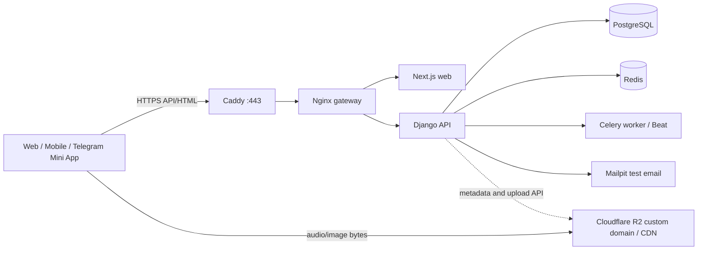

# Staging: создание с нуля и первый запуск

Дата проверки инструкции: 25 августа 2026 года.

Staging — отдельная публичная копия приложения для проверки реального HTTPS, интеграций,
миграций, SEO, мониторинга и нагрузки до production. Она не использует production-БД,
production-секреты или production-bucket.

Фактический бюджетный staging проекта создан: `https://staging.iqro.forum` работает на Hetzner
CX23 через budget overlay, TLS и запрет индексации активны, backup/verify/restore-check выполнен.
Для media создан отдельный Cloudflare R2 bucket `iqro-staging-media`, ограниченный этим bucket
API token и CORS для `https://staging.iqro.forum`; public-read/Range проверен на отдельном
диагностическом объекте. Делегирование `iqro.forum` на Cloudflare nameservers принято реестром
25 августа 2026 года. Custom hostname `media.staging.iqro.forum`, edge TLS, точный CORS,
`X-Content-Type-Options: nosniff` и отдельное cache rule только для media hostname активны;
staging переключён с временного `r2.dev` на custom domain. Автоматический CDN contract
(HEAD/Range/416/CORS/ETag/cache headers) зелёный, а повторный Range-запрос подтверждён как
`CF-Cache-Status: HIT`; машинный результат сохранён в
[CDN contract report](capacity/staging-r2-media-contract-2026-08-25.json). Последний
зафиксированный Quran content-backed capacity результат находится в
[strict budget отчёте CX23](capacity/staging-cx23-quran-budget-2026-08-25.md); прогон с более
широкими per-container ceilings сохранён в
[host-level отчёте](capacity/staging-cx23-quran-content-2026-08-25.md), а исторический прогон до
активации corpus сохранён в
[pre-publication отчёте](capacity/staging-cx23-prepublication-2026-08-25.md).
Отдельный synthetic audio Range-прогон через R2/CDN подтвердил 25 playback-клиентов и границу
деградации на 30; доказательства и ограничения находятся в
[audio CDN отчёте](capacity/staging-r2-synthetic-audio-2026-08-25.md).
Изолированный guest auth/token refresh/reading sync прогон подтвердил 8 постоянно активных
stateful-клиентов и latency boundary на 10; рабочая staging-БД осталась без test-маркеров.
Методика и машинные отчёты находятся в
[stateful sync отчёте](capacity/staging-cx23-stateful-sync-2026-08-25.md).

Среда ещё не является production: `madani-hafs@1.0.2` временно активирован только на закрытом от
индексации staging для технического content-backed/load test, а 604 проверенных WebP загружены в
отдельный staging bucket. Это исключение не снимает provenance и три внешних sign-off; версия
не разрешена для production-публикации. Лицензированного аудиорелиза в staging пока нет.
Существующие Quran.Foundation production credentials безопасно
перенесены из локального закрытого env без вывода значений; read-only запрос каталога из backend
успешно прошёл 25 августа 2026 года и вернул 21 chapter reciter. Фоновая синхронизация остаётся
выключенной (`QF_AUDIO_SYNC_ENABLED=false`), данные аудио не импортировались и не публиковались.
Offsite backup и постоянный production-sized observability stack также не закрыты. Инструкция
ниже остаётся источником истины для пересоздания staging и последующего production rollout;
секреты и IP-ограничения в документацию не записываются.

## Что уже автоматизировано

- `compose.staging.yaml` добавляет к production topology автоматический HTTPS через Caddy и
  тестовую почту Mailpit;
- `ops/staging/init.py` создаёт отдельный env, генерирует независимые секреты и ставит права
  `0600`; существующий файл он не перезаписывает;
- `ops/staging/preflight.py` проверяет домены, proxy chain, разделение БД, HTTPS, секреты и
  готовность media, не печатая значения секретов;
- `ops/staging/configure_media.py` безопасно записывает R2 credentials и генерирует точную CORS
  policy для staging origins;
- Caddy выпускает и продлевает TLS certificate, делает HTTP → HTTPS redirect и запрещает
  индексирование staging через `X-Robots-Tag` и отдельный `robots.txt`;
- Mailpit перехватывает email-коды внутри staging. Его web UI слушает только `127.0.0.1` VPS;
- все ежедневные команды доступны как `make staging-*`.



Главное следствие схемы: аудиобайты не проходят через VPS или Django. Увеличение числа
чтецов/качества увеличивает storage/CDN usage, но не требует заранее покупать media-серверы.

## 1. Что нужно создать вручную

### 1.1. Два имени

Пример для домена `example.org`:

- приложение: `staging.example.org`;
- media/CDN: `media.staging.example.org`.

Первое имя будет указывать на VPS. Второе позже подключается прямо к R2 bucket и **не** должно
указывать на VPS.

### 1.2. VPS

Стандартный staging-профиль рассчитан на:

- 4 vCPU;
- 8 GiB RAM;
- 80 GiB SSD;
- Ubuntu 24.04/26.04 LTS x86_64;
- публичный IPv4 и SSH key.

Это стартовая конфигурация, а не доказанная ёмкость. Для capacity/soak окна с полным
Prometheus/Grafana baseline разумно временно увеличить VPS до 8 vCPU/16 GiB, провести замер и
вернуть меньший размер. Так постоянная мощность покупается по текущей потребности, а не под
100 000 DAU заранее.

Для бюджетного функционального staging разрешён профиль 2 vCPU / 4 GiB RAM / 40 GiB SSD
(например Hetzner CX23), но только через `compose.staging.budget.yaml`. Он запускает по одному
API/Celery worker, уменьшает memory/CPU ceilings, собирает образы последовательно и не включает
постоянный observability stack. Такой сервер проверяет продуктовые сценарии, HTTPS, R2 и smoke,
но его результаты нельзя объявлять capacity-гарантией будущего более мощного production.
После полного или точечного rollout запускайте `make staging-budget-runtime-verify`: команда
сравнивает фактические Docker CPU/RAM limits всех работающих реплик с budget overlay и
fail-closed обнаруживает смешанный профиль.

В firewall провайдера открыть:

| Порт | Источник | Назначение |
|---:|---|---|
| `22/tcp` | только ваш текущий IP | SSH |
| `80/tcp` | internet | ACME и HTTP → HTTPS |
| `443/tcp`, `443/udp` | internet | HTTPS/HTTP3 |

PostgreSQL, Redis, backend, Mailpit, Grafana и Prometheus наружу не открывать. Docker может
обходить некоторые правила UFW, поэтому основную границу лучше задать firewall самого VPS
provider; это отдельно отмечено и в официальной
[Docker Ubuntu installation guide](https://docs.docker.com/engine/install/ubuntu/).

### 1.3. DNS приложения

Создать запись:

```text
Type: A
Name: staging
Value: <PUBLIC_VPS_IP>
TTL: Auto
Proxy: DNS only на время первого запуска
```

Проверка с локального компьютера:

```bash
dig +short staging.example.org
```

Команда должна вернуть IP нового VPS. Запись media пока не создаётся вручную: её добавит
подключение R2 custom domain.

## 2. Установка Docker на пустой VPS

Подключиться по SSH и установить Docker Engine/Compose из официального apt repository. Актуальный
источник команд — [Docker Engine on Ubuntu](https://docs.docker.com/engine/install/ubuntu/):

```bash
sudo apt update
sudo apt install -y ca-certificates curl git
sudo install -m 0755 -d /etc/apt/keyrings
sudo curl -fsSL https://download.docker.com/linux/ubuntu/gpg -o /etc/apt/keyrings/docker.asc
sudo chmod a+r /etc/apt/keyrings/docker.asc
sudo tee /etc/apt/sources.list.d/docker.sources >/dev/null <<EOF
Types: deb
URIs: https://download.docker.com/linux/ubuntu
Suites: $(. /etc/os-release && echo "${UBUNTU_CODENAME:-$VERSION_CODENAME}")
Components: stable
Architectures: $(dpkg --print-architecture)
Signed-By: /etc/apt/keyrings/docker.asc
EOF
sudo apt update
sudo apt install -y docker-ce docker-ce-cli containerd.io docker-buildx-plugin docker-compose-plugin
sudo usermod -aG docker "$USER"
```

Переподключиться по SSH, затем проверить:

```bash
docker version
docker compose version
```

Членство в группе `docker` фактически даёт административный доступ к host. На staging оно
выдаётся только отдельному deploy-пользователю с SSH key.

На 4 GiB host один раз добавьте 2 GiB swap только как защиту от краткого пика во время сборки:

```bash
sudo fallocate -l 2G /swapfile
sudo chmod 600 /swapfile
sudo mkswap /swapfile
sudo swapon /swapfile
echo '/swapfile none swap sw 0 0' | sudo tee -a /etc/fstab
free -h
```

Swap не заменяет RAM и не используется для доказательства capacity; его задача — не допустить
OOM во время первой последовательной Docker-сборки.

## 3. Доставка текущего commit на сервер

Сейчас у проекта нет Git remote, поэтому безопасный первый вариант — передать только tracked
файлы текущего commit, без локальных env и незакоммиченных файлов.

На VPS один раз:

```bash
sudo mkdir -p /opt/quran
sudo chown "$USER":"$USER" /opt/quran
```

На локальном компьютере из корня проекта:

```bash
git archive --format=tar HEAD | ssh <USER>@<PUBLIC_VPS_IP> 'tar -xf - -C /opt/quran'
```

После добавления private Git remote сервер лучше перевести на checkout конкретного release
commit/tag. Не копируйте на VPS локальные `.env`, `.git` или development database.

## 4. Создание staging-конфигурации

На VPS:

```bash
cd /opt/quran
make staging-init \
  STAGING_HOST=staging.example.org \
  STAGING_MEDIA_HOST=media.staging.example.org \
  STAGING_ACME_EMAIL=ops@example.org
```

Команда создаёт игнорируемый Git файл `ops/staging/staging.env`, генерирует все application
secrets и ничего секретного не выводит. Повторный запуск не перезапишет существующий файл.

Проверить базовую готовность:

```bash
make staging-preflight
make staging-budget-config  # 2 vCPU / 4 GiB
# make staging-config       # стандартный 4 vCPU / 8 GiB профиль
```

До настройки R2 первая команда покажет `WARN`. Это сознательно разрешает поднять текст/API и
HTTPS раньше, но не разрешает публиковать media или считать audio capacity проверенной.

## 5. Первый запуск сайта и API

Убедиться, что DNS уже возвращает IP VPS, затем:

```bash
make staging-budget-up
make staging-budget-ps
```

Caddy обратится к ACME CA, получит certificate для `STAGING_HOST` и будет автоматически его
продлевать. Для автоматического HTTPS публичные `80` и `443` должны быть доступны; это требование
описано в [Caddy HTTPS quick-start](https://caddyserver.com/docs/quick-starts/https).

Проверка:

```bash
curl -I http://staging.example.org/
curl -I https://staging.example.org/
curl https://staging.example.org/api/v1/health/ready
curl https://staging.example.org/robots.txt
```

Ожидается redirect на HTTPS, успешный HTTPS-ответ, ready health и `Disallow: /` для robots.

Если запуск не прошёл:

```bash
make staging-budget-ps
make staging-budget-logs
```

### Тестовые email-коды

Mailpit не опубликован в internet. Открыть SSH tunnel на локальном компьютере:

```bash
ssh -L 8025:127.0.0.1:8025 <USER>@<PUBLIC_VPS_IP>
```

Пока SSH открыт, UI доступен только вам на `http://127.0.0.1:8025`. Коды входа staging
появляются там и не отправляются реальным адресатам.

## 6. Подключение Cloudflare R2 для изображений и аудио

Этот этап обязателен до media publication и audio capacity test, но не до первого HTTPS smoke.

В Cloudflare dashboard:

1. Создать отдельный bucket, например `quran-staging`.
2. Создать R2 API token с Object Read & Write только для этого bucket.
3. Сохранить `Account ID`, `Access Key ID` и `Secret Access Key`; secret показывается один раз.
4. В bucket → Settings → Custom Domains подключить `media.staging.example.org` и дождаться
   статуса `Active`. Cloudflare требует, чтобы domain zone находилась в том же account; custom
   domain включает CDN/cache controls. `r2.dev` для этой среды не нужен. См.
   [официальную инструкцию public bucket/custom domain](https://developers.cloudflare.com/r2/buckets/public-buckets/).

На VPS безопасно записать credentials (они не попадут в shell history или stdout):

```bash
make staging-media-configure \
  STAGING_R2_ACCOUNT_ID=<32_HEX_ACCOUNT_ID> \
  STAGING_R2_BUCKET=quran-staging
```

Команда запросит Access Key ID и Secret Access Key скрытым вводом, обновит `staging.env` и
создаст `ops/staging/r2-cors.json`. Содержимое JSON не секретно. Его нужно вставить в
bucket → Settings → CORS Policy → JSON и сохранить. Policy разрешает только точные staging
origins, `GET`/`HEAD`, Range и нужные плееру response headers. Формат соответствует
[Cloudflare R2 CORS guide](https://developers.cloudflare.com/r2/buckets/cors/).

После активации domain/CORS:

```bash
make staging-media-preflight
make staging-up
```

Для фактического staging проекта 25 августа 2026 года дополнительно включены два бесплатных
Cloudflare rule, оба с точным условием `http.host eq "media.staging.iqro.forum"`:

- response header transform `X-Content-Type-Options: nosniff`;
- cache eligibility с origin `Cache-Control`/default edge TTL и сохранением strong ETag.

После переключения `PUBLIC_MEDIA_BASE_URL`, `PUBLIC_AUDIO_BASE_URL` и `STAGING_MEDIA_HOST`
указывают на `https://media.staging.iqro.forum/`; backend, worker и beat пересозданы без
перезапуска PostgreSQL, Redis, web или gateway. Readiness и `make staging-media-preflight`
остались зелёными.

Далее accepted/versioned assets загружаются immutable upload-командами из раздела
[Managed media CDN contract](operations.md#managed-media-cdn-contract), а публичный CDN contract
проверяется до активации релиза. Credential нельзя вставлять в браузер, mobile app, Telegram
Mini App, Git или issue tracker.

## 7. Monitoring, backup и нагрузка

Наблюдаемость включается только на время эксплуатационной проверки или load window:

```bash
make staging-observability-up
```

Не запускайте этот полный stack на бюджетном 4 GiB host одновременно с приложением: для него
используются health/metrics endpoints, `docker stats` и bounded JSON reports. Полный временной ряд
Prometheus/Grafana и финальный capacity run выполняются уже на production-sized машине.

Grafana/Prometheus/Alertmanager слушают loopback. Пример tunnel для Grafana:

```bash
ssh -L 3001:127.0.0.1:3001 <USER>@<PUBLIC_VPS_IP>
```

Затем открыть `http://127.0.0.1:3001`. После теста:

```bash
make staging-observability-down
```

До первого release window выполнить:

```bash
make staging-backup
# Первая команда печатает точный BACKUP_FILE; передайте его двум следующим:
make staging-backup-verify BACKUP_FILE=/backups/quran_staging_TIMESTAMP.dump
make staging-restore-check BACKUP_FILE=/backups/quran_staging_TIMESTAMP.dump
```

После этого по порядку запускаются public-read, audio-CDN и disposable auth/sync сценарии из
[operations runbook](operations.md#staged-public-read-capacity-test). Число стабильных
одновременных пользователей фиксируется только из JSON reports и server-side metrics реального
staging, не из DAU и не из лимитов Docker Compose.

Фактический strict budget content-backed прогон 25 августа 2026 года подтвердил на CX23 10
непрерывно активных saturated read-only клиентов в течение двух минут: 4 612 запросов,
38.41 RPS, 0% ошибок, p95 682 ms. На 12 клиентах общий p95 вырос до 779 ms и gate не прошёл.
Полный отчёт и ограничения результата:
[strict budget Quran capacity evidence](capacity/staging-cx23-quran-budget-2026-08-25.md).
Synthetic warm audio CDN часть подтвердила 25 playback-клиентов при 256 kbps request profile;
изолированный guest auth/sync профиль подтвердил 8 тяжёлых stateful-клиентов, а 10 не уложились
в p95 750 ms. Реалистичный смешанный прогон с паузами подтвердил одновременно 20 public-read
клиентов и 4 guest sync-пользователя без ошибок; краткий cold/burst и `50+10` не прошли latency
gate. Новый registered email account + sync подтвердил 4 active users; 6/8 завершились без
ошибок, но нарушили latency gate. Реальный разрешённый multi-reciter audio release, cache-cold,
existing-account/multi-device identity и production-sized repeat ещё открыты. Подробности — в
[mixed capacity evidence](capacity/staging-cx23-mixed-realistic-2026-08-25.md) и
[registered-user evidence](capacity/staging-cx23-registered-user-2026-08-25.md). Отдельный
[bounded real-audio probe](capacity/staging-qf-real-audio-2026-08-25.md) подтвердил обычный
startup/seek delivery трёх QF-чтецов, но нашёл metadata size drift у source `7`; это не
provider load test и не разрешение на публикацию.

## 8. Обновление и откат

Перед обновлением всегда сохранить проверенный backup:

```bash
make staging-backup
# Использовать точный BACKUP_FILE из вывода предыдущей команды:
make staging-backup-verify BACKUP_FILE=/backups/quran_staging_TIMESTAMP.dump
```

Передать новый проверенный commit тем же `git archive`, затем на VPS:

```bash
cd /opt/quran
make staging-budget-config
make staging-budget-up
make staging-budget-runtime-verify
make staging-budget-ps
```

`staging.env`, PostgreSQL/Redis volumes, Caddy certificates и backup directory не входят в Git
archive и сохраняются. `make` автоматически маркирует staging images коротким SHA текущего
commit. Для воспроизводимого отката нужно хранить номер ранее развёрнутого commit и развернуть
его archive тем же способом; migration compatibility проверяется до rollout.

### Временная проверка нескольких реплик на budget staging

Это бесплатная проверка механизма горизонтального масштабирования на том же VPS, а не новый
capacity-профиль и не high availability. Сначала должны быть собраны и запущены проверенные
release images. Команда валидирует границы, подставляет реальное число API-реплик в database
connection budget и только затем меняет topology без сборки образов:

```bash
cd /opt/quran
make staging-budget-scale API_REPLICAS=2 WEB_REPLICAS=2
make staging-budget-ps
python3 ops/load/smoke.py \
  --base-url https://staging.example.org \
  --requests 200 \
  --concurrency 10
```

Во время окна проверить, что видны ровно две healthy `backend` и две healthy `web` реплики,
gateway распределяет некэшируемые probe-запросы между обоими backend, а 5xx, p95, host RAM,
swap и database headroom остаются в пределах gate. На CX23 не оставлять `2+2` постоянно без
измеренной необходимости: после доказательства вернуть экономный профиль той же безопасной
командой:

```bash
make staging-budget-scale API_REPLICAS=1 WEB_REPLICAS=1
make staging-budget-ps
```

Потеря единственного VPS по-прежнему остановит все реплики. Настоящая HA начинается только с
нескольких hosts/зон и внешнего load balancer.

## 9. Definition of done

Staging считается созданным, когда одновременно выполнено:

- `https://STAGING_HOST` и readiness отвечают извне;
- HTTP перенаправляется на HTTPS, certificate валиден, staging закрыт от индексации;
- `make staging-preflight` и `make staging-config` зелёные;
- email login проверен через закрытый Mailpit UI;
- отдельный R2 bucket/custom domain/CORS активны и `make staging-media-preflight` зелёный;
- на стандартном профиле Grafana доступна через SSH tunnel и alert delivery проверена; на
  budget-профиле сохранены health/metrics/load reports, а полный observability gate остаётся
  открытым до production-sized среды;
- backup → verify → restore-check выполнены;
- integration E2E и пять capacity harness — public-read, audio, isolated sync, mixed и
  registered-user — дали сохранённые reports.

До выполнения этих пунктов roadmap checkbox «production-like staging deployed» остаётся открыт.
