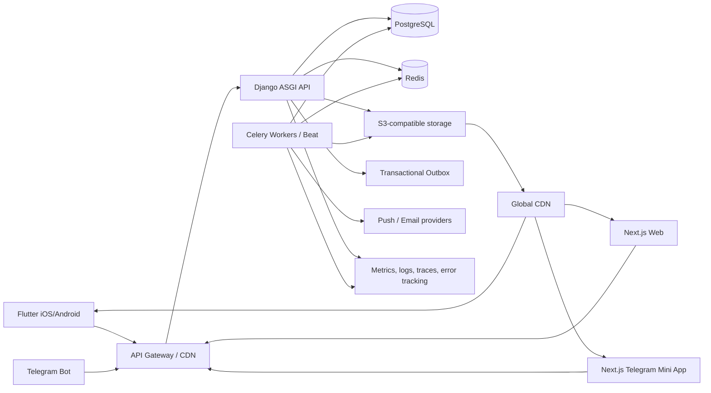

# Техническое задание: Quran Platform

## 1. Паспорт документа

| Поле | Значение |
|---|---|
| Название проекта | Quran Platform (рабочее название) |
| Тип системы | Многоклиентская исламская контентная платформа |
| Основной предмет ТЗ | Backend на Django и контракты интеграции клиентских приложений |
| Клиенты | Flutter iOS/Android, веб-сайт Next.js, Telegram Mini App на Next.js |
| Версия документа | 1.0 |
| Дата | 9 августа 2026 года |
| Статус | Утверждённая спецификация для оценки и планирования реализации |
| Backend | Django 6.1, Python 3.14 |
| Языки MVP | Арабский, английский, русский |
| Возрастная аудитория | 16+ |

### 1.1. Назначение документа

Документ является исходным техническим заданием для продуктовой, backend-, mobile-, frontend-, QA-, DevOps-, контентной и религиозно-редакционной команд. Он определяет границы MVP, архитектуру, модели данных, API, правила синхронизации, безопасность, эксплуатационные показатели и критерии приёмки.

Если реализация расходится с настоящим ТЗ, команда должна оформить ADR (Architecture Decision Record), описать причину, последствия, миграцию и получить согласование владельца продукта и технического руководителя. Изменения религиозного контента дополнительно согласуются ответственным религиозным редактором.

### 1.2. Термины

- **Мусхаф** — утверждённое визуальное издание текста Корана.
- **Аят** — минимальная адресуемая единица текста Корана.
- **Сура, джуз, хизб, руб‘ аль-хизб** — канонические единицы навигации.
- **Риваят** — вариант передачи чтения; в MVP используется Хафс ‘ан ‘Асым.
- **Чтец** — исполнитель аудиозаписи Корана.
- **Контентная версия** — неизменяемая опубликованная редакция материала.
- **Офлайн-пакет** — версионированный набор файлов и метаданных с контрольными суммами.
- **Гостевой пользователь** — пользователь без связанного внешнего способа входа.
- **Устройство** — отдельная установка Flutter-приложения либо клиентская браузерная сессия.
- **Mini App** — веб-приложение, запущенное внутри Telegram WebView.
- **P0** — обязательное для MVP; **P1** — следующий релиз; **P2** — перспективное развитие.

## 2. Концепция продукта

Quran Platform должна предоставить единое, уважительное и технически надёжное пространство для чтения и прослушивания Корана, возвращения к последней позиции, формирования привычки чтения, повторения аятов и получения напоминаний о намазе.

Пользователь может начать без регистрации. Регистрация нужна только для резервного хранения и синхронизации прогресса между устройствами и платформами. Основной религиозный контент не должен блокироваться рекламой, регистрацией или оплатой.

### 2.1. Проблема

Пользователи часто вынуждены использовать несколько несвязанных приложений: одно для мусхафа, другое для аудио, третье для намаза и отдельные источники для тафсиров, хадисов и дуа. Состояние чтения не синхронизируется, офлайн-режим непредсказуем, источники и редакции контента непрозрачны, а реклама может появляться в неподходящем контексте.

### 2.2. Цели MVP

1. Обеспечить точное постраничное чтение мадинского мусхафа Хафс на 604 страницах.
2. Обеспечить устойчивое потоковое и офлайн-воспроизведение нескольких чтецов.
3. Синхронизировать закладки, прогресс, настройки и цели между Flutter, веб-сайтом и Telegram Mini App.
4. Рассчитывать времена намаза с учётом координат, метода расчёта, мазхаба, часового пояса и поездок.
5. Предоставить локальные напоминания, работающие без сети.
6. Ввести проверяемый редакционный процесс и полную трассируемость контента.
7. Обеспечить безопасное администрирование рекламы без вторжения в чтение и поклонение.
8. Собирать структурированную обратную связь, особенно сообщения об ошибках религиозного контента.
9. Заложить модульную основу для хадисов, дуа, книг и видео без необходимости переписывать ядро.

### 2.3. Измеримые показатели успеха после запуска

- Не менее 99,9% успешных ответов API, исключая корректные 4xx.
- Crash-free sessions Flutter не ниже 99,5%.
- Не менее 99% успешных возобновлений чтения с последней синхронизированной позиции.
- Не менее 99% валидных офлайн-пакетов после проверки checksum.
- Расхождение времени намаза с эталонной реализацией выбранного метода — не более 60 секунд до применения пользовательской поправки.
- P95 ответа read API из региона пользователя — не более 300 мс без учёта загрузки медиафайла.
- P95 ответа write API — не более 500 мс.
- Начало аудиопотока через CDN: P75 не более 2 секунд на типичном 4G/Wi‑Fi.
- Доля обращений об ошибках религиозного контента, получивших первичную классификацию за 24 часа, — не менее 95%.
- Ноль показов рекламы в запрещённых зонах по автоматическим и ручным проверкам.

## 3. Пользователи и роли

### 3.1. Пользовательские персоны

1. **Читатель**: читает постраничный мусхаф, сохраняет позицию и закладки.
2. **Слушатель**: выбирает чтеца, слушает с выключенным экраном, загружает аудио.
3. **Изучающий**: повторяет аят или диапазон, регулирует скорость и паузы.
4. **Путешественник**: получает актуальное расписание намаза при смене координат и часового пояса.
5. **Гость**: пользуется основными функциями без передачи персональных данных.
6. **Зарегистрированный пользователь**: синхронизирует состояние между платформами.
7. **Контентный редактор**: импортирует и исправляет материалы в черновиках.
8. **Религиозный рецензент**: утверждает или отклоняет религиозный контент.
9. **Оператор поддержки**: обрабатывает обращения и отвечает пользователям.
10. **Рекламный менеджер**: создаёт кампании в разрешённых зонах.
11. **Системный администратор**: управляет доступом, конфигурацией и эксплуатацией.
12. **Аудитор**: имеет read-only доступ к журналам и версиям.

### 3.2. Матрица ролей backend

| Действие | Пользователь | Поддержка | Редактор | Рецензент | Реклама | Администратор | Аудитор |
|---|---:|---:|---:|---:|---:|---:|---:|
| Читать опубликованный контент | Да | Да | Да | Да | Да | Да | Да |
| Менять личные данные | Только свои | Нет | Нет | Нет | Нет | По регламенту | Нет |
| Создавать обращение | Да | Да | Да | Да | Да | Да | Нет |
| Обрабатывать обращения | Нет | Да | Нет | Нет | Нет | Да | Просмотр |
| Создавать черновик контента | Нет | Нет | Да | Да | Нет | Да | Просмотр |
| Публиковать религиозный контент | Нет | Нет | Нет | Да | Нет | Только при наличии роли | Просмотр |
| Управлять рекламой | Нет | Нет | Нет | Нет | Да | Да | Просмотр |
| Управлять ролями | Нет | Нет | Нет | Нет | Нет | Да | Просмотр |
| Читать аудит | Нет | Ограниченно | Своё | Контент | Реклама | Да | Да |

Запрещено объединять повседневную учётную запись сотрудника и break-glass доступ. Критические роли используют MFA. Все привилегированные действия журналируются.

## 4. Объём работ и приоритеты

### 4.1. P0 — MVP

- Гостевой режим и единый пользовательский аккаунт.
- Русская, английская и арабская локализации; поддержка RTL.
- Мадинский мусхаф Хафс на 604 страницах.
- Навигация по страницам, сурам, аятам, джузам, хизбам и руб‘ аль-хизбам.
- Интерактивный слой областей аятов поверх страниц.
- Последняя позиция, закладки, история сессий, цели и серии дней.
- Несколько чтецов, потоковое и офлайн-аудио.
- Повтор аятов/диапазонов, учебные паузы, скорость 0,5–2,0×, таймер сна.
- Фоновое воспроизведение Flutter и системные media controls.
- Офлайн-пакеты и синхронизация после восстановления сети.
- Заглушки и готовая модель для переводов и тафсиров.
- Время намаза, методы расчёта, мазхаб, ручные поправки.
- Короткие локальные уведомления; напоминания о чтении и повторении.
- Управляемая реклама только на главном экране и в каталоге.
- Внешние ссылки для пожертвований.
- Модуль обратной связи и редакционный workflow.
- Django Admin и специализированные административные экраны/API.
- Наблюдаемость, резервное копирование, аудит, CI/CD.

### 4.2. P1 — после MVP

- Полные переводы и тафсиры после лицензирования и редакционной проверки.
- Хадисы, сборники дуа и другие книги как отдельные домены.
- Полноценное видео и образовательные подборки.
- Telegram Stars для пожертвований после отдельной правовой и платформенной проверки.
- Полный азан там, где это допускают ОС и настройки пользователя.
- Семейные профили, расширенные планы повторения и виджеты.
- Дополнительные риваяты и визуальные издания мусхафа.

### 4.3. P2 — вне текущего планирования

- Запись голоса, распознавание чтения и автоматическая оценка таджвида.
- Социальная лента, публичные рейтинги, комментарии и личные сообщения.
- Собственная платёжная обработка и хранение платёжных реквизитов.
- Маркетплейс авторского контента.
- Рекламная сеть с поведенческим профилированием.

## 5. Архитектурный подход

### 5.1. Стиль архитектуры

Backend реализуется как **модульный монолит** с чёткими границами доменов. Это не набор микросервисов на этапе MVP. Один репозиторий и основной deployment упрощают транзакции, миграции, наблюдаемость и эксплуатацию, но доменная логика не должна зависеть от внутренних моделей другого приложения напрямую.

Разрешённые способы взаимодействия модулей:

- публичные Python-сервисы/интерфейсы доменного приложения;
- доменные события через transactional outbox;
- стабильные идентификаторы и read-модели;
- REST API для внешних клиентов.

Запрещено:

- импортировать чужие ORM-модели из слоя представления или сериализатора;
- размещать бизнес-логику в views, signals или Celery tasks;
- использовать Django signals для критических междоменных процессов без outbox и идемпотентного обработчика;
- отдавать медиафайлы через Django в production.

### 5.2. Контейнеры системы

### 5.3. Django-приложения

| Приложение | Ответственность |
|---|---|
| `core` | Общие типы, ID, время, локализация, health checks, feature flags |
| `accounts` | Пользователи, гостевые профили, внешние identities, consent, устройства |
| `quran` | Издания, суры, аяты, страницы, координаты, навигация |
| `translations` | Переводы, тафсиры, языковые версии и лицензии |
| `media` | Медиаобъекты, CDN-ключи, метаданные, checksum |
| `recitations` | Чтецы, наборы чтения, аудиосегменты, тайминги |
| `library` | Абстракции каталога; расширение для книг, хадисов, дуа и видео |
| `reading` | Позиция, закладки, история, цели, серии, пользовательские коллекции |
| `downloads` | Манифесты офлайн-пакетов, версии, зависимости, отзыв пакетов |
| `prayer_times` | Методы расчёта, профили, справочники, серверная проверка |
| `reminders` | Правила напоминаний, расписания, quiet hours, delivery log |
| `notifications` | Push-токены, шаблоны, очередь и статусы доставки |
| `editorial` | Черновики, версии, review, публикация, откат и аудит контента |
| `feedback` | Тикеты, сообщения, вложения, контекст, SLA и маршрутизация |
| `advertising` | Разрешённые placements, кампании, креативы, лимиты и агрегаты |
| `donations` | Настраиваемые ссылки/провайдеры и обезличенная атрибуция переходов |
| `analytics` | События продукта с минимизацией данных и consent gating |
| `audit` | Неизменяемый журнал привилегированных действий |
| `integrations` | Telegram, push, email, object storage и внешние адаптеры |

Каждое приложение должно содержать по необходимости: `models`, `services`, `selectors`, `api`, `tasks`, `events`, `admin`, `tests`, `management/commands`. Общие абстракции не переносятся в `core`, пока не возникнут минимум два реальных потребителя.

### 5.4. Технологический стек backend

- Python 3.14.x с фиксацией patch-версии в CI и образах.
- Django 6.1; разрешены совместимые patch-обновления 6.1.x после прохождения CI.
- Django REST Framework для REST API.
- OpenAPI 3.1, генерируемый из кода и проверяемый в CI.
- PostgreSQL актуальной поддерживаемой major-версии; расширения подключаются только миграциями.
- Redis для кэша, rate limiting, distributed locks и брокера задач.
- Celery + Celery Beat для фоновых и периодических работ.
- ASGI-сервер, поддерживающий graceful shutdown и корректную передачу proxy headers.
- S3-совместимое хранилище и CDN с HTTP Range, ETag и immutable assets.
- Docker/OCI, непривилегированный runtime user, read-only root filesystem где возможно.
- Менеджер зависимостей с lock-файлом и hash verification.

Перед началом разработки необходимо выполнить compatibility spike для Python 3.14, Django 6.1, DRF, Celery и библиотек расчёта намаза. Несовместимая библиотека заменяется или изолируется; понижение Django без ADR запрещено.

## 6. Общие функциональные требования

### 6.1. Первый запуск

Последовательность Flutter:

1. Выбор языка с возможностью изменить его позже.
2. Краткое объяснение чтения, аудио, офлайна и намаза.
3. Предложение продолжить гостем или войти; регистрация не обязательна.
4. Запрос геолокации только при открытии настройки намаза.
5. Запрос разрешения уведомлений только при включении первого напоминания.
6. Загрузка bootstrap-конфигурации и минимального пакета мусхафа.
7. Переход на главный экран.

Последовательность веб-сайта и Mini App не должна блокироваться запросами системных разрешений. Telegram identity предлагается связать с существующим аккаунтом, если совпадение невозможно определить безопасно.

Главный экран содержит:

- «Продолжить чтение»;
- ближайший намаз и время до него;
- продолжение последнего аудио;
- быстрый доступ к Корану, намазу и загрузкам;
- активную цель/напоминание;
- одну разрешённую рекламную область, если есть подходящая кампания.

### 6.2. Локализация и доступность

- Все пользовательские строки хранятся как ключи локализации; строки backend не должны быть источником UI-текста, кроме контента и fallback-сообщений.
- Арабский интерфейс работает в RTL; числовые и медиа-контролы проверяются отдельно.
- Арабский текст Корана не преобразуется библиотеками локализации и не зеркалится.
- API принимает `Accept-Language`, но канонические данные возвращает с явным `language`/`edition`.
- Даты и время передаются в ISO 8601; timezone — IANA ID, например `Europe/Istanbul`.
- Web соответствует WCAG 2.2 AA для основных сценариев.
- Flutter поддерживает screen readers, масштабирование текста, достаточный контраст и touch targets не менее платформенного минимума.
- Критическая навигация доступна без цветовой дифференциации.

## 7. Аккаунты, аутентификация и устройства

### 7.1. Сценарии

- При первой установке backend создаёт гостевой профиль и installation-bound credential.
- Гость может читать, слушать, создавать закладки, цели и локальные загрузки.
- Гость может связать email, Google, Apple или Telegram и стать зарегистрированным пользователем без потери локальных данных.
- Один аккаунт может иметь несколько внешних identities каждого допустимого типа с ограничениями безопасности.
- При попытке привязать identity, уже принадлежащую другому аккаунту, автоматическое слияние запрещено; запускается безопасный recovery flow.
- Удаление аккаунта не удаляет канонический контент, но удаляет/анонимизирует пользовательские данные согласно retention policy.

### 7.2. Требования к токенам

- Access token короткоживущий: целевое значение 10–15 минут.
- Refresh token ротируется при каждом использовании; повторное использование старого токена отзывает семейство токенов.
- Для web предпочтительна защищённая HttpOnly Secure SameSite cookie-сессия/BFF; токен нельзя сохранять в `localStorage`.
- Flutter хранит refresh credential только в Keychain/Keystore.
- Telegram `initData` всегда валидируется на backend: подпись, срок, bot audience и replay protection; `initDataUnsafe` не считается доверенным.
- Logout отдельного устройства и logout всех устройств обязательны.
- Смена email, связывание identity, удаление аккаунта и действия администратора требуют re-authentication.

### 7.3. Основные сущности

| Сущность | Ключевые поля |
|---|---|
| `User` | `id UUIDv7`, `status`, `primary_email`, `preferred_locale`, `timezone`, timestamps |
| `AuthIdentity` | `user_id`, `provider`, `provider_subject`, verified metadata, unique constraint |
| `GuestProfile` | `user_id`, `installation_hash`, `expires_at`, merge status |
| `Device` | `id`, `user_id`, `platform`, `installation_id_hash`, app version, locale, last_seen |
| `PushEndpoint` | `device_id`, provider, encrypted token, environment, status, last_error |
| `Consent` | `user_id/device_id`, purpose, policy version, granted/withdrawn timestamps |
| `UserPreference` | locale, theme, default reciter, reading mode, notification defaults |
| `RefreshSession` | token family hash, device, issued/last-used/revoked timestamps, risk data |

IP-адреса и user-agent в security logs имеют ограниченный срок хранения и маскируются там, где это возможно.

## 8. Модуль мусхафа и Корана

### 8.1. Каноническая модель

MVP содержит одно опубликованное издание: мадинский мусхаф, риваят Хафс ‘ан ‘Асым, 604 страницы. Архитектура поддерживает несколько изданий и риваятов, но данные разных изданий никогда не смешиваются без явного `edition_id`.

| Сущность | Назначение и ограничения |
|---|---|
| `QuranEdition` | Код, название, риваят, источник, лицензия, версия, статус публикации |
| `Surah` | Номер 1–114, арабское/локализованные названия, тип ниспослания, порядок |
| `Ayah` | Edition, сура, номер аята, канонический текст, Uthmani text, search-normalized text |
| `Juz` | Номер 1–30 и начальная ссылка на аят |
| `HizbMarker` | Тип маркера, номер, ссылка на аят/позицию |
| `MushafPage` | Edition, номер 1–604, размеры оригинала, asset key, checksum |
| `AyahPageRegion` | Page, ayah, строка/полигон координат, reading order, region version |
| `SajdahMarker` | Тип и ссылка на аят |
| `QuranSourceManifest` | Версия импорта, контрольные суммы, ожидаемые counts, provenance |

Текст Корана, номера аятов, соответствие страницам и координаты являются каноническими данными повышенной критичности. Их нельзя редактировать обычной формой Django Admin. Изменения проходят импорт, автоматическую сверку, двойную ручную проверку и публикацию новой версии.

### 8.2. Визуальное отображение

- Страница предоставляется как оптимизированный immutable asset в нескольких разрешениях/форматах с исходной контрольной суммой.
- Интерактивный слой хранится отдельно от изображения в нормализованных координатах 0..1.
- Клиент масштабирует координаты с сохранением aspect ratio.
- Нажатие на область открывает действия: воспроизвести, повторять, добавить закладку, перейти к переводу/тафсиру, сообщить об ошибке.
- При перекрытии областей выбирается область по reading order и минимальной площади; поведение покрывается тестами.
- Клиент обязан уметь показать страницу без интерактивного слоя, если слой повреждён, но должен отправить диагностическое событие.

### 8.3. Навигация

- Переход к странице, суре, аяту, джузу, хизбу и закладке.
- Листание в направлении, соответствующем мусхафу, независимо от языка UI.
- Индекс сур содержит название, номер, число аятов и первую страницу.
- Индекс джузов содержит диапазон и первую страницу.
- Deep links имеют стабильную форму: edition/surah/ayah либо edition/page.
- Невалидная ссылка возвращает структурированную ошибку и предлагает ближайшую корректную сущность только на клиенте.

### 8.4. Проверки целостности импорта

Публикация блокируется, если не выполнено хотя бы одно условие:

- ровно 114 сур, 30 джузов и 604 страницы для заявленного издания;
- номера сур, аятов и страниц непрерывны в допустимых диапазонах;
- каждый аят связан минимум с одной страницей;
- каждая область ссылается на существующий аят и находится в границах 0..1;
- manifest и все asset checksum совпадают;
- текстовые контрольные суммы совпадают с утверждённым источником;
- отсутствуют orphan records и дубли канонических ключей;
- религиозный рецензент утвердил конкретную версию.

## 9. Чтение, закладки, прогресс и цели

### 9.1. Сущности

| Сущность | Поля |
|---|---|
| `ReadingPosition` | user, edition, page, ayah, intra-page anchor, updated_at, revision, device_id |
| `Bookmark` | client-generated UUIDv7, user, edition, ayah/page, label, color key, note, created/updated/deleted timestamps |
| `RetiredBookmarkId` | user, физически удалённый bookmark UUID, последняя revision, retired_at; компактный неизменяемый анти-resurrection ledger |
| `ReadingSession` | start/end, start/end references, active seconds, pages/ayahs completed, device |
| `ReadingGoal` | metric (`pages/ayahs/minutes`), target, cadence, timezone, active period |
| `GoalProgress` | goal, local date, achieved amount, source sessions |
| `Streak` | current, longest, last qualifying local date, recalculation version |
| `UserCollection` | name and ordered bookmark membership; необязательно отображать в первом UI |

### 9.2. Правила

- «Продолжить чтение» использует последнюю явно зафиксированную позицию, а не последний случайно открытый экран.
- Flutter записывает локальную позицию при смене страницы и отправляет debounce sync не чаще одного раза в 5 секунд, а также при уходе приложения в background.
- История чтения не должна начислять прогресс при быстром пролистывании без минимального времени взаимодействия.
- Серия дней считается по пользовательскому часовому поясу; смена timezone не должна задним числом лишать достигнутого дня.
- Удаление закладки реализуется tombstone-записью для корректной офлайн-синхронизации.
- Tombstone физически удаляется только после retention всех change/operation записей и атомарной записи в bounded per-user `RetiredBookmarkId`; unseen UUIDv7 старше разрешённого offline-окна также не может быть создан повторно с revision 1.
- Пользователь может очистить историю, сбросить цель и отключить серию дней.
- Публичные рейтинги и сравнение пользователей отсутствуют.

## 10. Аудио и чтецы

### 10.1. Модель данных

| Сущность | Назначение |
|---|---|
| `Reciter` | Имя на языках, slug, биография, изображение, статус |
| `RecitationEdition` | Чтец, Quran edition/riwayah, стиль, источник, лицензия, версия |
| `AudioTrack` | Сура/джуз/другой логический трек, duration, codec, bitrate, asset key, checksum |
| `AyahAudioSegment` | Ayah, track, start/end milliseconds либо отдельный asset |
| `AudioTimingVersion` | Версия таймингов и источник проверки |
| `PlaybackState` | User, queue context, track, ayah, position_ms, speed, updated_at, revision |

### 10.2. Функции MVP

- Выбор чтеца и сохранение выбора в профиле.
- Воспроизведение суры, джуза, отдельного аята и диапазона аятов.
- Очередь воспроизведения и переход между сурами.
- Скорость: минимум 0,5×, 0,75×, 1×, 1,25×, 1,5×, 2×.
- Повтор аята/диапазона: бесконечно или заданное число 1–100.
- Пауза между повторами: 0–30 секунд.
- Учебный режим: чтение аята, затем настраиваемая пауза для самостоятельного повторения.
- Таймер сна: конец аята, конец суры либо 5/10/15/30/45/60 минут.
- Синхронное выделение текущего аята при наличии проверенных таймингов.
- Продолжение с последней позиции с допуском сохранения не хуже 5 секунд.
- Обработка interruption: звонок, другой audio focus, отключение гарнитуры.

### 10.3. Доставка аудио

- Django выдаёт метаданные и подписанный/публичный CDN URL, но не проксирует байты.
- CDN обязан поддерживать `Range`, `ETag`, `Last-Modified`, корректный MIME и CORS для web origins.
- Аудиофайлы immutable; замена создаёт новый asset key и content version.
- Для Корана предпочтительны файлы по сурам либо валидированные сегменты с byte/time ranges. Тысячи запросов на мелкие файлы одного аята допускаются только после нагрузочного теста.
- Клиент проверяет checksum полностью загруженного офлайн-файла.
- Источник, лицензия и право распространения обязательны до публикации чтеца.

### 10.4. Платформенные требования

Flutter обязан поддерживать background playback, системный media notification/lock screen, headset controls и восстановление очереди после перезапуска в пределах возможностей ОС.

Web использует Media Session API при наличии и не обещает воспроизведение после закрытия браузера.

Telegram Mini App предоставляет аудио только пока WebView и платформа позволяют воспроизведение. Backend и UI не должны заявлять гарантированное фоновое воспроизведение Mini App после закрытия или выгрузки Telegram.

## 11. Офлайн-режим и пакеты

### 11.1. Типы пакетов

- `mushaf-core`: индексы, канонические ссылки и базовые страницы.
- `mushaf-hd`: страницы повышенного разрешения.
- `recitation-surah`: аудио конкретной суры и чтеца.
- `recitation-juz`: логическая подборка зависимых аудиофайлов.
- `recitation-full`: полный набор чтеца.
- `translation`: перевод конкретного языка/редакции.
- `tafsir`: тафсир конкретного языка/редакции.

### 11.2. Манифест

Манифест содержит: `package_id`, `type`, `version`, `edition_id`, `language`, `reciter_id`, `total_bytes`, список файлов, SHA-256 каждого файла, зависимости, минимальную версию клиента, дату публикации, статус отзыва и delta/base version при наличии.

### 11.3. Требования загрузки

- Показ требуемого и свободного места до старта.
- Пауза, продолжение и повтор загрузки после обрыва.
- Ограничение Wi‑Fi only и разрешение мобильного трафика.
- Параллелизм и backoff настраиваются удалённой конфигурацией.
- Atomic install: пакет становится доступен только после полной проверки.
- При нехватке места клиент не удаляет данные без явного согласия.
- Пользователь видит размер каждого пакета и может удалить его независимо, если нет обязательной зависимости.
- Отозванный из-за критической ошибки пакет блокируется от новой установки; уже установленный получает предупреждение и безопасную замену.
- Личные закладки и прогресс не входят в удаляемые контентные пакеты.

## 12. Переводы, тафсиры и библиотека

В MVP API и схема полностью готовы, но пользовательский контент может быть представлен утверждёнными заглушками «готовится к публикации».

### 12.1. Сущности

- `TextEdition`: тип, язык, название, автор/организация, лицензия, источник, версия.
- `AyahTranslation`: edition, ayah, text, footnotes, content version.
- `TafsirEntry`: edition, диапазон аятов, rich text в безопасном формате, references.
- `LibraryItem`: тип (`hadith_collection`, `dua_collection`, `book`, `video_series`), metadata, publication state.
- `LibrarySection` и `LibraryEntry`: иерархия и содержимое будущих модулей.

HTML от редакторов проходит allowlist sanitization. Предпочтительный внутренний формат — структурированный JSON/rich text с контролируемыми узлами; произвольные scripts, inline event handlers и iframe запрещены.

Модули хадисов, дуа, книг и видео получают отдельные Django apps либо доменные пакеты при начале P1; `library` не должен превращаться в универсальную таблицу без типизированных ограничений.

## 13. Время намаза

### 13.1. Принцип

Расчёт выполняется прежде всего локально на Flutter-устройстве, чтобы сохранять приватность координат и работать без сети. Backend предоставляет версионированную конфигурацию методов, справочники и эталонный endpoint для проверки/резервного расчёта. Web и Mini App могут рассчитывать локально либо вызывать fallback endpoint.

### 13.2. Входные данные

- широта и долгота;
- высота, если доступна и поддерживается алгоритмом;
- дата и IANA timezone;
- метод расчёта;
- мазхаб для `Asr`;
- правило высоких широт;
- пользовательские поправки по каждой молитве;
- настройка использования более точной локации или выбранного города.

### 13.3. Результат

- Fajr, Sunrise, Dhuhr, Asr, Maghrib, Isha;
- локальная дата, timezone и UTC offset;
- метод, параметры и версия алгоритма;
- признак полярного/high-latitude fallback;
- применённые пользовательские поправки;
- время следующего пересчёта.

### 13.4. Приватность координат

- Координаты не сохраняются на backend по умолчанию.
- Fallback-запрос с координатами не записывает query/body в access/application logs и трассировки.
- Для сохранённого места используется город либо округлённая локация только после отдельного согласия.
- История перемещений не создаётся.
- Клиент объясняет, зачем нужно разрешение и как переключиться на ручной город.

### 13.5. Корректность

- Поддерживается несколько распространённых методов расчёта как конфигурация, а не ветвление UI-кода.
- Значение по умолчанию выбирается по региональной настройке, но всегда показывается пользователю.
- `Asr` поддерживает как минимум стандартный и ханафитский shadow factor.
- Высокие широты имеют явные стратегии; молчаливый `null` без объяснения запрещён.
- Переход DST, смена timezone, пересечение полуночи и международной линии дат покрываются тестами.
- Пользовательские поправки ограничены безопасным диапазоном, например ±120 минут, с предупреждением.

## 14. Напоминания и уведомления

### 14.1. Типы правил

- пять намазов по отдельности;
- до/в момент/после намаза;
- ежедневное чтение в локальное время;
- цель в страницах, аятах или минутах;
- продолжение незавершённой сессии;
- повтор выбранного аята/диапазона по расписанию;
- уведомление о готовности/ошибке офлайн-загрузки;
- ответ поддержки на обращение.

### 14.2. Локальное и серверное расписание

- Намаз и личные регулярные напоминания планируются локально на Flutter.
- Клиент перепланирует уведомления после смены timezone, локации, метода, DST, системного времени или разрешений.
- Backend хранит правила для синхронизации, но не является единственной точкой срабатывания.
- Push используется для ответов поддержки, служебных сообщений и необязательного backup, но не гарантирует точную доставку ко времени намаза.
- Web/Mini App используют web/Telegram notifications только после отдельного opt-in и в пределах возможностей платформы.

### 14.3. MVP-сигнал

- Короткий системно допустимый звук, локализованный текст и название молитвы.
- Полный автоматический азан не входит в гарантии MVP.
- Пользователь может выбрать silent/vibration/sound, если ОС позволяет.
- Настройки ОС имеют приоритет; приложение показывает диагностику выключенных разрешений.
- Quiet hours применяются ко всем некритичным напоминаниям, но не скрывают явно включённое уведомление о намазе без предупреждения.

## 15. Обратная связь

### 15.1. Категории

- общее предложение;
- техническая ошибка;
- ошибка или сомнение в религиозном контенте;
- проблема изображения/разметки страницы;
- проблема аудио/таймингов/чтеца;
- жалоба на рекламу;
- аккаунт и синхронизация;
- пожертвование или внешняя ссылка;
- доступность и локализация;
- другое.

### 15.2. Сущности

| Сущность | Поля |
|---|---|
| `FeedbackTicket` | public number, category, subject, status, priority, reporter, locale, channel, assignee/team, SLA timestamps |
| `FeedbackMessage` | ticket, author type, body, visibility (`public/internal`), created_at |
| `FeedbackAttachment` | message/ticket, object key, MIME, size, checksum, scan status, retention |
| `FeedbackContext` | edition, surah, ayah, page, reciter, track, playback_ms, content version, ad campaign, route |
| `DiagnosticBundle` | app/build/OS, device class, network class, redacted logs, explicit consent |
| `FeedbackAudit` | actor, transition, old/new values, reason, timestamp |

### 15.3. Workflow

Статусы: `new → triaged → in_progress → waiting_for_user → resolved`, а также `rejected`, `duplicate`, `closed`. Повторное сообщение пользователя по закрытому тикету создаёт re-open либо новый связанный тикет по настройке категории.

Сообщение об ошибке религиозного контента автоматически получает высокий маршрутный приоритет, но не автоматически изменяет контент. Оператор связывает тикет с editorial change request. Публикация исправления проходит обычный review и хранит ссылку на исходный тикет.

### 15.4. Защита и приватность

- Гость может отправить обращение с необязательным email; ответ без контакта доступен по непредсказуемому secure link/коду.
- Для публичной web-формы применяются rate limit, honeypot и CAPTCHA после risk threshold.
- Вложения загружаются по pre-signed URL, карантинируются, проверяются на тип, размер и malware.
- Допустимые форматы MVP: JPEG, PNG, WebP, PDF и plain text; исполняемые файлы запрещены.
- Диагностические логи прикладываются только после preview и явного согласия; токены, координаты, email и содержимое других экранов редактируются.
- Уведомление пользователю отправляется при публичном ответе и смене значимого статуса.

### 15.5. SLA

- Критическая подтверждённая ошибка канонического текста/страницы: немедленная эскалация, первичная реакция до 4 часов.
- Остальной религиозный контент: первичная классификация до 24 часов.
- Технический блокер входа/чтения: до 1 рабочего дня.
- Общие предложения: без гарантии ответа, но с подтверждением получения.

## 16. Редакционная система

### 16.1. Состояния версии

`draft → technical_review → religious_review → approved → scheduled/published → superseded`.

Дополнительные состояния: `changes_requested`, `rejected`, `withdrawn`, `emergency_hidden`.

### 16.2. Правила

- Опубликованная версия immutable.
- Исправление создаёт новую версию с diff, причиной и ссылками на источник.
- Автор черновика не может единолично утвердить критический религиозный материал.
- Публикация канонического текста/разметки требует двух-person rule.
- Плановая публикация обрабатывается идемпотентной задачей.
- Откат переключает active version на ранее опубликованную, не удаляя историю.
- Emergency hide требует причины, уведомляет ответственных и журналируется.
- Preview использует те же serializers/renderers, что production-клиенты, но отдельную авторизацию.
- Импорт идемпотентен по source manifest/version.

## 17. Реклама

### 17.1. Разрешённые placement

- один слот на главном экране;
- каталог/экран обзора разделов;
- будущие явно согласованные некритические каталоги.

### 17.2. Запрещённые placement

- страница мусхафа и любые переходы между страницами/аятами;
- аудиоплеер, очередь и промежутки воспроизведения;
- перевод, тафсир, хадис, дуа и религиозный текст;
- экран времени намаза и уведомления;
- экран обратной связи об ошибке религиозного контента;
- onboarding, authentication и системные ошибки.

### 17.3. Кампания

Кампания содержит владельца, название, статус, start/end UTC, языки, страны/регионы на уровне страны, placement allowlist, frequency cap, общий лимит показов, priority/weight, креативы, целевой URL, UTM, moderation state и audit trail.

### 17.4. Ограничения

- Только first-party ad server под контролем администратора в MVP.
- Никакого поведенческого профилирования, передачи advertising ID и создания религиозных interest profiles.
- Таргетинг только по выбранному языку, приблизительной стране и платформе; координаты не используются.
- Креатив до публикации проходит ручную модерацию.
- Запрещены реклама азартных игр, алкоголя, табака/вейпов, наркотических веществ, дейтинга и сексуализированного контента, ростовщических/вводящих в заблуждение финансовых продуктов, оружия, политической агитации, разжигания вражды, непроверенных медицинских обещаний, мошеннических схем и материалов, не соответствующих возрасту 16+.
- Администратор ведёт версионированный policy checklist; одобрение содержит имя модератора, дату, основания и снимок креатива/целевой страницы на момент проверки.
- Изменение файла креатива или целевого домена после одобрения автоматически возвращает кампанию на модерацию.
- Клик открывает interstitial с доменом назначения для внешних ссылок при необходимости.
- Impression считается только после viewability threshold; повторные события идемпотентны.
- Отчётность агрегируется; сырые события имеют короткий retention.
- Feature flag может глобально отключить всю рекламу без релиза клиентов.

## 18. Пожертвования

- Администратор создаёт локализованные карточки пожертвований с объяснением назначения средств.
- MVP использует внешние HTTPS-ссылки на разрешённого провайдера.
- Backend не принимает номер карты, CVV и другие платёжные реквизиты.
- Redirect URL проверяется по allowlist доменов и не может быть произвольным.
- Можно учитывать агрегированный переход/возврат без суммы и финансовых данных, если пользователь дал analytics consent.
- Платёжный webhook не нужен для MVP, пока приложение не показывает подтверждённую транзакцию.
- Telegram Stars рассматривается отдельным P1-интеграционным проектом.
- Тексты не обещают налоговый статус пожертвования без юридического подтверждения для региона.

## 19. API

### 19.1. Общие правила

- Базовый путь: `/api/v1/`.
- JSON в `snake_case`, UTF-8.
- Время: ISO 8601 UTC с `Z`; локальная дата — `YYYY-MM-DD`; timezone — IANA.
- Идентификаторы внешних сущностей — UUID; канонические номера сур/аятов также доступны как числа.
- Любой list endpoint использует cursor pagination; offset разрешён только для маленьких административных справочников.
- Изменяющие запросы клиентов поддерживают `Idempotency-Key` там, где повтор может создать дубликат.
- Ответ содержит `X-Request-ID`; входящий безопасный request ID может быть принят/перегенерирован.
- Ошибки используют `application/problem+json`: `type`, `title`, `status`, `code`, `detail`, `instance`, `field_errors`, `request_id`.
- API не возвращает локализованный текст как единственный способ определить ошибку; клиенты используют `code`.
- OpenAPI schema, примеры и сгенерированные SDK проверяются в CI на breaking changes.
- Breaking change требует `/v2` либо периода совместимости и deprecation headers.

### 19.2. Кэширование

- Публичный канонический контент: `Cache-Control: public, immutable` для versioned URLs.
- Индексы/конфигурация: `ETag` и `If-None-Match`, короткий `max-age`, `stale-while-revalidate`.
- Персональные ответы: `private, no-store` либо корректный private cache; CDN не кэширует Authorization responses.
- Подписанные media URLs не включаются в аналитические логи целиком.
- Purge CDN выполняется только для mutable aliases; versioned assets не перезаписываются.

### 19.3. Основные endpoint-группы

#### Bootstrap и конфигурация

- `GET /api/v1/bootstrap` — языки, feature flags, active editions, методы намаза, минимальные версии клиентов.
- `GET /api/v1/config/versions` — версии справочников и пакетов.
- `GET /api/v1/health/live` — liveness без зависимостей.
- `GET /api/v1/health/ready` — readiness критических зависимостей.

#### Аутентификация

- `POST /api/v1/auth/guest`
- `POST /api/v1/auth/email/start`
- `POST /api/v1/auth/email/verify`
- `POST /api/v1/auth/oauth/{provider}`
- `POST /api/v1/auth/telegram`
- `POST /api/v1/auth/token/refresh`
- `POST /api/v1/auth/logout`
- `POST /api/v1/auth/logout-all`
- `POST /api/v1/auth/identities/link`
- `DELETE /api/v1/auth/identities/{id}`

#### Пользователь

- `GET/PATCH /api/v1/me`
- `GET/PATCH /api/v1/me/preferences`
- `GET /api/v1/me/devices`
- `DELETE /api/v1/me/devices/{id}`
- `POST /api/v1/me/export`
- `POST /api/v1/me/deletion-request`
- `POST /api/v1/me/deletion-cancel`
- `GET/PUT /api/v1/me/consents/{purpose}`

#### Коран

- `GET /api/v1/quran/editions`
- `GET /api/v1/quran/editions/{edition}`
- `GET /api/v1/quran/editions/{edition}/surahs`
- `GET /api/v1/quran/editions/{edition}/surahs/{surah}`
- `GET /api/v1/quran/editions/{edition}/ayahs/{surah}/{ayah}`
- `GET /api/v1/quran/editions/{edition}/pages/{page}`
- `GET /api/v1/quran/editions/{edition}/juz`
- `GET /api/v1/quran/editions/{edition}/navigation`
- `GET /api/v1/quran/resolve?surah=&ayah=`

Ответ страницы содержит versioned image variants, размеры, checksum, области аятов и ссылки на соседние страницы. Полный арабский текст может поставляться отдельным versioned dataset, чтобы не перегружать каждый ответ.

#### Чтецы и аудио

- `GET /api/v1/reciters`
- `GET /api/v1/reciters/{id}`
- `GET /api/v1/recitations`
- `GET /api/v1/recitations/{id}/tracks`
- `GET /api/v1/recitations/{id}/surahs/{surah}`
- `GET /api/v1/recitations/{id}/ayahs/{surah}/{ayah}`
- `POST /api/v1/media/sign` — только для закрытых assets, с узким scope.

#### Чтение и синхронизация

- `GET/PUT /api/v1/me/reading-position/{edition}`
- `GET/POST /api/v1/me/bookmarks`
- `GET/PATCH/DELETE /api/v1/me/bookmarks/{id}`
- `POST /api/v1/me/reading-sessions`
- `GET/POST /api/v1/me/goals`
- `PATCH/DELETE /api/v1/me/goals/{id}`
- `GET /api/v1/me/progress`
- `GET/PUT /api/v1/me/playback-state`
- `POST /api/v1/sync/push`
- `GET /api/v1/sync/pull?cursor=`

#### Офлайн-пакеты

- `GET /api/v1/download-packages`
- `GET /api/v1/download-packages/{id}`
- `GET /api/v1/download-packages/{id}/manifest`
- `GET /api/v1/download-packages/updates?installed=`

#### Намаз и напоминания

- `GET /api/v1/prayer/methods`
- `POST /api/v1/prayer/calculate` — fallback, координаты редактируются из логов.
- `GET/PUT /api/v1/me/prayer-profile`
- `GET/POST /api/v1/me/reminders`
- `PATCH/DELETE /api/v1/me/reminders/{id}`
- `POST /api/v1/me/push-endpoints`
- `DELETE /api/v1/me/push-endpoints/{id}`

#### Обратная связь

- `POST /api/v1/feedback/tickets`
- `GET /api/v1/feedback/tickets`
- `GET /api/v1/feedback/tickets/{public_id}`
- `POST /api/v1/feedback/tickets/{public_id}/messages`
- `POST /api/v1/feedback/attachments/presign`
- `POST /api/v1/feedback/attachments/{id}/complete`
- `POST /api/v1/feedback/tickets/{public_id}/close`

#### Реклама и пожертвования

- `GET /api/v1/placements/{placement}/ad`
- `POST /api/v1/ads/{creative}/impression`
- `POST /api/v1/ads/{creative}/click`
- `GET /api/v1/donations/options`
- `POST /api/v1/donations/{option}/click`

### 19.4. Rate limiting

Минимальные политики, уточняемые нагрузочными тестами:

- чтение публичного каталога: высокий anonymous limit с CDN;
- login/OTP: строгий лимит на IP, identity и device с progressive backoff;
- token refresh: на token family/device;
- feedback guest: низкий лимит, risk-based CAPTCHA;
- impression/click: на installation, creative и временное окно;
- sync: batch limits по числу операций и размеру тела;
- admin: лимит плюс отдельная защита WAF/VPN/SSO при наличии.

Ответ 429 содержит `Retry-After` и стабильный error code.

## 20. Офлайн-синхронизация

### 20.1. Общая модель

Клиент хранит локальную БД и журнал операций. Каждая изменяемая пользовательская сущность имеет UUID, `revision`, `updated_at`, `device_id` и `deleted_at`. Сервер возвращает монотонный sync cursor, не основанный только на wall-clock клиента.

### 20.2. Push

`POST /sync/push` принимает пакет операций с `operation_id`, entity type/id, base revision, mutation и client timestamp. Сервер:

1. проверяет scope, размер и взвешенный лимит по числу операций;
2. дедуплицирует `operation_id`;
3. применяет пакет во внешней транзакции, а ожидаемые accepted/conflict результаты фиксирует по каждой операции; fatal domain error откатывает пакет целиком;
4. возвращает accepted state либо conflict;
5. записывает change feed/outbox;
6. возвращает новый cursor.

Квоты и ожидаемые конфликты возвращаются в результате конкретной операции и также
идемпотентно сохраняются по `operation_id`; они не превращают уже частично применённый пакет в
неповторяемую общую HTTP-ошибку.

### 20.3. Pull

`GET /sync/pull?cursor=` возвращает изменения всех разрешённых типов, tombstones и следующий cursor. Ответ ограничен размером и поддерживает `has_more`. Cursor имеет срок жизни; при его истечении сервер требует безопасный full resync.

Full resync является авторитетной заменой локального синхронизированного набора: после получения
всех страниц клиент удаляет локальные сущности, отсутствующие в snapshot, устанавливает
`snapshot_cursor` и сразу продолжает incremental pull.

### 20.4. Разрешение конфликтов

- Закладки с разными UUID объединяются.
- Изменение одной закладки: field-level merge, а при одновременном изменении одного поля — server received order с возвратом conflict metadata клиенту.
- Удаление закладки выигрывает у более старого изменения; более новое явное восстановление создаёт новую revision.
- Reading position: выбирается наиболее свежая осмысленная пользовательская позиция; server хранит recent candidates для предотвращения прыжка назад при позднем sync старого устройства.
- Playback position: latest valid progress в пределах той же очереди; завершённый трек не возвращается в середину из-за старого устройства.
- Preferences: last accepted revision per field.
- Goals/reminders: optimistic concurrency; конфликт изменения расписания показывается пользователю либо разрешается последним подтверждённым изменением.
- Серверное время является авторитетным для порядка при слишком большом clock skew.

### 20.5. Guest merge

При регистрации клиент отправляет guest sync до link. Затем backend выполняет идемпотентное слияние гостевого пользователя с целевым аккаунтом, применяя правила конфликтов, переводит устройства и отзывает guest credentials. Операция имеет audit record и может безопасно повториться после сетевого сбоя.

## 21. Требования к клиентам

### 21.1. Flutter iOS/Android

- Единая кодовая база с платформенными адаптерами для audio session, background playback, notifications, secure storage и downloads.
- Локальная БД поддерживает миграции, транзакции и индексы для навигации.
- Offline-first repository: UI читает локально, сеть обновляет состояние.
- Download manager переживает перезапуск, соблюдает network/battery policies ОС.
- Плеер является самостоятельным application service, не привязанным к lifecycle экрана.
- Universal/App Links открывают точный аят, страницу, чтеца или тикет.
- Push payload не содержит чувствительный текст или координаты.
- Remote config имеет безопасные локальные defaults.
- Минимальные версии iOS/Android фиксируются отдельным ADR после анализа рынка и библиотек.

### 21.2. Next.js веб-сайт

- App Router, server rendering/static generation для публичных индексируемых страниц.
- Canonical URLs, hreflang для `ar/en/ru`, корректный RTL и metadata.
- Авторизованные запросы предпочтительно проходят через BFF/session cookie.
- Service Worker/PWA может кэшировать базовые страницы и metadata, но не обещает такой же объём offline audio, как Flutter.
- Не секретные публичные данные могут кэшироваться edge/CDN.
- Web player использует Media Session при поддержке.
- Consent banner показывается только для реально используемых необязательных аналитических технологий.

### 21.3. Next.js Telegram Mini App

- Общие UI/domain пакеты с web допускаются, но deployment и Telegram adapter отделены.
- `initData` передаётся backend для проверки; `initDataUnsafe` используется только для предварительного UI.
- Учитываются Telegram theme params, safe area, back button, viewport и fullscreen.
- UI mobile-first; тяжёлые эффекты отключаются на слабых устройствах.
- Deep link `startapp` может открывать суру, аят, страницу или кампанию только после строгой валидации параметра.
- Связывание Telegram identity не должно захватывать существующий аккаунт.
- Mini App сохраняет небольшое состояние в доступном Telegram/device storage, но сервер остаётся источником синхронизации.
- Фоновое аудио после закрытия WebView не является критерием приёмки.

## 22. Фоновые задачи и события

### 22.1. Обязательные задачи

- построение и проверка офлайн-манифестов;
- проверка checksum/metadata новых медиа;
- импорт контента и генерация diff;
- плановая публикация/отзыв версии;
- отправка push/email и обработка provider receipts;
- удаление недействительных push tokens;
- пользовательский data export/deletion;
- агрегация рекламы и продуктовой аналитики;
- SLA-эскалация feedback;
- очистка quarantined/expired attachments;
- создание резервных служебных отчётов целостности.

### 22.2. Надёжность

- Все задачи идемпотентны либо защищены idempotency key.
- Внешний вызов не выполняется внутри открытой DB transaction.
- Событие записывается через transactional outbox в той же транзакции, что бизнес-изменение.
- Retry использует exponential backoff с jitter и максимальным числом попыток.
- После исчерпания попыток сообщение попадает в dead-letter/quarantine и создаёт alert.
- Периодическая reconciliation восстанавливает пропущенные состояния.
- Celery task payload содержит идентификаторы, а не большие документы или секреты.

## 23. Безопасность

### 23.1. Базовые требования

- Secure by default по OWASP ASVS и OWASP API Security Top 10.
- TLS 1.2+ с предпочтением TLS 1.3; HSTS после проверки доменов.
- Пароли, если будут введены, хэшируются Argon2id; предпочтительный MVP-вход по verified email code/OAuth.
- Секреты хранятся в secret manager, не в репозитории и не в образах.
- Шифрование дисков, БД backups и object storage server-side.
- Полевая encryption применяется к push tokens и особо чувствительным интеграционным данным.
- CSRF обязателен для cookie-auth; CORS использует точный allowlist.
- CSP, frame policy, trusted origins и secure headers настраиваются отдельно для web и Telegram origins.
- Upload никогда не исполняется и не раздаётся с того же origin до прохождения проверки.
- SSRF-защита для URL импорта/креативов; redirect allowlist для пожертвований и рекламы.
- ORM не заменяет validation: object-level authorization проверяется в каждом selector/service.

### 23.2. Административная безопасность

- MFA для всех сотрудников; для суперпользователей — phishing-resistant фактор при возможности.
- Принцип минимальных привилегий и разделение ролей.
- Отдельный admin hostname и дополнительный access control по возможности.
- Сессии сотрудников короткие, с re-auth для публикации, экспорта и управления ролями.
- Массовые операции требуют preview/count и подтверждения.
- Audit log append-only, с защитой от изменения обычным администратором.
- Break-glass аккаунт хранится отдельно, использование немедленно оповещает владельца системы.

### 23.3. Threat cases, обязательные для тестов

- подделка Telegram init data;
- replay refresh token и replay idempotency key;
- IDOR для закладок, тикетов, вложений и устройств;
- XSS через rich text, перевод, рекламу и feedback;
- вредоносный upload/polyglot;
- cache leak персонального ответа через CDN;
- массовое скачивание signed assets вне scope;
- OTP enumeration/brute force;
- privilege escalation редактора до публикации;
- логирование координат, access token или signed URL;
- formula injection в CSV-экспорте админки;
- decompression bomb и чрезмерный JSON sync payload.

## 24. Приватность и жизненный цикл данных

### 24.1. Принципы

- Data minimization, purpose limitation, explicit consent, privacy by default.
- Геолокация для намаза обрабатывается локально, если пользователь не запросил fallback.
- Религиозные привычки чтения не используются для рекламного профилирования.
- Продуктовая аналитика отделена от security logs и рекламной отчётности.
- Пользователь может отключить необязательную аналитику без потери основной функции.

### 24.2. Предварительная retention policy

| Данные | Срок/правило |
|---|---|
| Аккаунт и синхронизируемые данные | Пока аккаунт активен; удаление по запросу |
| Tombstones sync | Минимум окно максимального офлайна, целево 180 дней |
| Security/auth logs | 90–180 дней по результатам DPIA |
| Raw product analytics | До 90 дней; затем агрегирование/удаление |
| Raw ad events | До 30 дней; затем агрегирование |
| Feedback | По категории, целево 24 месяца; религиозные исправления могут храниться как audit evidence |
| Неиспользованные attachments | Автоудаление после quarantine/expiry |
| Backups | 35 дней operational + политика долгосрочных snapshots по решению владельца |

Точные сроки утверждаются до production после юридического анализа целевых стран. Backend должен поддерживать конфигурируемые сроки и legal hold с аудитом.

### 24.3. Права пользователя

- Скачать данные в машиночитаемом формате.
- Удалить аккаунт с grace period, целево 7 дней.
- Отменить удаление в grace period после повторной аутентификации.
- Отозвать consent и прекратить дальнейший сбор.
- Удалить отдельные закладки, историю и устройства.
- Получить сведения о привязанных identities и активных сессиях.

## 25. Производительность и масштабирование

### 25.1. Проектная нагрузка MVP

- 100 000 зарегистрированных аккаунтов.
- 10 000 DAU.
- До 1 000 одновременно активных клиентов.
- Кратковременный пик до 300 API RPS.
- Медиа-трафик обслуживается CDN и не входит в пропускную способность Django.
- Архитектура допускает горизонтальное масштабирование stateless API и workers.

### 25.2. SLO

| Показатель | Цель |
|---|---|
| Доступность публичного API | 99,9% в месяц |
| P95 cached read | ≤ 300 мс |
| P95 authenticated write | ≤ 500 мс |
| P99 API | ≤ 1 000 мс для обычных операций |
| Error rate 5xx | < 0,5% за 5 минут; алерт при превышении |
| Sync batch | 500 операций или 1 MiB, P95 ≤ 2 сек |
| Bootstrap payload gzip | Целево ≤ 200 KiB без контентных datasets |
| Readiness после старта | ≤ 60 секунд |

### 25.3. Оптимизация

- Индексы проектируются по реальным query patterns и контролируются `EXPLAIN ANALYZE`.
- N+1 блокируется тестами/query count на ключевых endpoints.
- Большие datasets поставляются versioned files/CDN, не огромными JSON из ORM.
- Redis-кэш не является источником истины.
- Cache stampede предотвращается lock/single-flight или stale policy.
- DB connections ограничены; применяется connection pooling.
- Тяжёлые exports/imports выполняются асинхронно.
- Нагрузочное тестирование включает cache-cold, cache-warm и CDN-bypass сценарии.

## 26. Надёжность, резервное копирование и DR

- Production развертывается минимум в нескольких availability zones одного европейского региона, если провайдер поддерживает.
- PostgreSQL: managed HA либо эквивалент, point-in-time recovery.
- Целевой RPO — 15 минут; RTO — 4 часа для MVP.
- Ежедневные backups и непрерывный WAL/PITR; шифрование и отдельный access policy.
- Restore drill минимум ежеквартально; успешный backup без проверки восстановления не считается достаточным.
- Object storage использует versioning/lifecycle и защиту от случайного удаления канонических assets.
- Runbooks: недоступность БД, Redis, CDN, object storage, push provider, компрометация ключа, ошибочная публикация контента.
- Graceful degradation: при падении персональных сервисов опубликованный Коран и ранее загруженное аудио остаются доступны через CDN/локально.
- Feature flags позволяют отключить рекламу, sync writes, конкретного чтеца, пакет или интеграцию.

## 27. Наблюдаемость

### 27.1. Метрики

- RPS, latency, status codes и saturation по endpoint group.
- DB connections, slow queries, locks, replica lag.
- Redis hit ratio, memory, evictions.
- Celery queue depth, age, duration, retries, failures, dead letters.
- CDN hit ratio, egress, 4xx/5xx, Range success.
- Auth failures, token reuse, OTP abuse.
- Sync conflicts, full resync, cursor expiry.
- Download manifest/checksum failures.
- Feedback SLA breaches.
- Рекламные показы в разрезе placement; отдельный invariant counter запрещённой зоны должен всегда быть нулём.

### 27.2. Логи и трассировка

- Structured JSON logs с request/correlation ID.
- Никаких access/refresh tokens, Telegram initData, точных координат, email body, attachment content и signed query string.
- PII redaction проверяется автоматическими тестами.
- Distributed tracing для API → DB/cache/outbox/worker; sampling не должен сохранять чувствительные payload.
- Error tracking получает release/environment и безопасный breadcrumb set.

### 27.3. Алерты

Алерт должен быть actionable, иметь severity, owner, runbook и protection от alert storm. Обязательные алерты: SLO burn rate, высокий 5xx, DB saturation, очередь старше порога, неуспешный backup, content integrity failure, security anomaly, массовая ошибка офлайн-пакетов.

## 28. Deployment и CI/CD

### 28.1. Среды

- `local`: воспроизводимая разработка без production secrets.
- `test/CI`: эфемерные зависимости и deterministic fixtures.
- `stage`: production-like, обезличенные/синтетические данные.
- `production`: отдельные аккаунты, secrets, buckets, DB и домены.

### 28.2. Pipeline

1. Форматирование и lint.
2. Static type checks.
3. Unit и property tests.
4. Integration tests с PostgreSQL/Redis/object storage emulator.
5. Проверка миграций и отсутствия незакоммиченных migrations.
6. OpenAPI generation + breaking-change check.
7. Dependency, secret, SAST и container scan.
8. Сборка подписанного immutable image с SBOM.
9. Deploy stage, smoke и contract tests.
10. Manual approval production для MVP.
11. Миграции по expand/contract.
12. Rolling/canary deploy и автоматический rollback по health/SLO.

### 28.3. Миграции

- Не блокировать большие таблицы длительной DDL в рабочее время.
- Добавление nullable/без default → backfill batch → constraint → cleanup.
- Код совместим минимум с предыдущей и новой схемой во время rolling deploy.
- Data migration повторяема, измерима и имеет dry-run.
- Удаление поля — отдельный релиз после прекращения чтения/записи.

## 29. Административная панель

### 29.1. Обязательные разделы

- пользователи и устройства с маскированием PII;
- источники, лицензии и импорты;
- издания мусхафа и отчёты целостности;
- чтецы, аудиотреки и тайминги;
- переводы/тафсиры и редакционные версии;
- офлайн-пакеты и отзыв версии;
- методы намаза и remote configuration;
- шаблоны уведомлений;
- feedback inbox, SLA, ответы и связи с editorial tasks;
- рекламные кампании, preview и отчёты;
- donation links;
- feature flags;
- audit log и system jobs.

### 29.2. UX и безопасность админки

- Фильтры, поиск, экспорт только разрешённых полей.
- Preview перед массовым действием.
- Нельзя редактировать канонический текст inline.
- Публикация показывает diff, источник, checksum и approvals.
- Опасные действия требуют причины и повторного подтверждения.
- CSV защищён от spreadsheet formula injection.
- Audit entry содержит actor, action, target, before/after summary, request ID и timestamp.

## 30. Тестирование

### 30.1. Backend

- Unit tests доменных сервисов и алгоритмов.
- Property-based tests для диапазонов аятов, sync revisions, timezone/DST и расчёта намаза.
- Integration tests PostgreSQL, Redis, Celery eager/non-eager, S3 adapter.
- Contract tests для OpenAPI и трёх клиентов.
- Golden fixtures утверждённого мусхафа и prayer calculations.
- Permission matrix tests для каждого административного endpoint.
- Security tests из раздела threat cases.
- Migration tests с копией реалистичного объёма данных.
- Load, soak и failure-injection tests.

### 30.2. Контент

- Контрольные суммы текста, страниц, аудио и manifests.
- Визуальная выборочная проверка всех страниц и автоматическое обнаружение отсутствующих/дублированных assets.
- Проверка координат областей на границы и reading order.
- Проверка соответствия аудиосегментов аятам на репрезентативной и риск-ориентированной выборке.
- Независимая редакционная приёмка первой опубликованной версии.

### 30.3. Клиенты

- Flutter: background/lock-screen controls, airplane mode, low storage, interrupted download, killed app, token expiry, timezone travel.
- Web: SSR/hydration, RTL, screen reader, keyboard navigation, cache headers, deep links.
- Mini App: подпись auth, темы, safe areas, back button, fullscreen, слабое устройство, закрытие WebView.
- Cross-client: создать закладку офлайн → изменить на другом устройстве → синхронизировать и проверить conflict rule.

### 30.4. Поддерживаемая матрица

Точные минимальные версии фиксируются перед реализацией. Обязательно тестируются последние две major-версии iOS, репрезентативные Android API уровни и OEM battery restrictions, актуальные Chrome/Safari/Firefox/Edge, а также Telegram iOS/Android/Desktop/Web в пределах официально поддерживаемых возможностей.

## 31. Критерии приёмки MVP

### 31.1. Коран

- [ ] Опубликовано утверждённое издание Хафс с 114 сурами, 30 джузами и 604 страницами.
- [ ] Все assets и канонические данные прошли checksum/integrity pipeline.
- [ ] Пользователь переходит к любой суре, аяту, джузу и странице.
- [ ] Нажатие на область аята стабильно выбирает правильный аят на поддерживаемых размерах экрана.
- [ ] Последняя подтверждённая позиция восстанавливается локально и после входа на другом устройстве.

### 31.2. Аудио

- [ ] Доступны минимум три полностью лицензированных чтеца для приёмочного релиза; каталог и API не имеют программного ограничения на их дальнейшее количество.
- [ ] Работают поток, offline download, repeat, range, speed, pause и sleep timer.
- [ ] Flutter продолжает воспроизведение с заблокированным экраном и обрабатывает media controls.
- [ ] После interruption состояние соответствует правилам ОС и пользовательским настройкам.
- [ ] Повреждённый файл не устанавливается как готовый пакет.

### 31.3. Намаз и напоминания

- [ ] Метод, мазхаб, timezone, high-latitude rule и поправки доступны в настройках.
- [ ] Результаты совпадают с утверждёнными golden cases.
- [ ] Координаты отсутствуют в логах и не сохраняются без consent.
- [ ] Короткие локальные уведомления работают без сети после предварительного планирования.
- [ ] Смена timezone/локации вызывает перепланирование.

### 31.4. Синхронизация

- [ ] Гостевые данные не теряются после регистрации.
- [ ] Закладки, позиции, цели, напоминания и playback state синхронизируются между клиентами.
- [ ] Повтор операции с тем же operation/idempotency ID не создаёт дубликат.
- [ ] Tombstones предотвращают возвращение удалённых данных.
- [ ] Full resync после истёкшего cursor не приводит к потере локальных изменений.

### 31.5. Обратная связь

- [ ] Гость и пользователь создают тикет и могут приложить безопасный файл.
- [ ] Контекст аята/страницы/аудио автоматически связывается с тикетом.
- [ ] Религиозная ошибка маршрутизируется по ускоренному SLA.
- [ ] Оператор отвечает, пользователь получает уведомление, история не изменяется задним числом.
- [ ] Тикет не может напрямую изменить опубликованный контент.

### 31.6. Реклама и пожертвования

- [ ] Автотесты подтверждают отсутствие рекламного placement на запрещённых экранах.
- [ ] Кампания учитывает период, язык, страну, frequency cap и ручное одобрение.
- [ ] Глобальный kill switch убирает рекламу без обновления клиента.
- [ ] Donation redirect принимает только allowlisted HTTPS-домены.
- [ ] Backend не принимает и не хранит платёжные реквизиты.

### 31.7. Качество и эксплуатация

- [ ] OpenAPI опубликована, SDK/контракты проходят CI.
- [ ] SLO проверены нагрузочным тестом на проектном пике.
- [ ] Restore drill подтверждает RPO/RTO.
- [ ] Нет critical/high уязвимостей без формального risk acceptance.
- [ ] Runbooks, dashboards и alerts доступны дежурной команде.
- [ ] Пройден launch checklist приватности, лицензий и религиозной редакции.

## 32. Этапы реализации

### Этап 0. Подготовка и spikes

- Проверка совместимости Django/Python/DRF/Celery.
- Аудит источника мусхафа, лицензий, структуры страниц и координат.
- Prototype background audio Flutter.
- Prototype prayer calculation parity.
- Prototype Telegram auth validation.
- ADR по auth/BFF, object storage/CDN, push providers и minimum OS.

### Этап 1. Platform foundation

- Репозиторий, CI/CD, environments, observability.
- Accounts, devices, consent, auth и audit.
- API conventions, OpenAPI и client generation.
- S3/CDN media pipeline.

### Этап 2. Quran reading vertical slice

- Импорт и integrity pipeline.
- Quran API, страницы, области, навигация.
- Flutter reading UI, web/Mini App basic reading.
- Reading position и bookmarks с offline sync.

### Этап 3. Audio и downloads

- Reciters/tracks/timings.
- Streaming/CDN и Flutter background player.
- Download manifests, resume, checksum, package UI.
- Playback sync и repetition modes.

### Этап 4. Prayer и reminders

- Methods/config/golden tests.
- Flutter local calculation/scheduling.
- Web/Mini App fallback.
- Goals, streaks и reminder sync.

### Этап 5. Editorial, feedback, ads, donations

- Version workflow и approvals.
- Feedback inbox, attachments, SLA и notifications.
- Controlled ad server и kill switch.
- Donation options и safe redirects.

### Этап 6. Hardening и launch

- Security/privacy review, load/soak tests, restore drill.
- Accessibility и RTL QA.
- Content acceptance и license sign-off.
- Store/web/Telegram release preparation.
- Canary launch, мониторинг KPI и rollback readiness.

## 33. Риски и меры снижения

| Риск | Последствие | Мера |
|---|---|---|
| Ошибка канонического текста/страницы | Критический репутационный и религиозный ущерб | Immutable версии, checksum, двойная проверка, emergency hide/rollback |
| Неточная координатная разметка | Неверный выбор/аудио аята | Версионирование regions, визуальные QA-инструменты, feedback context |
| Разные результаты намаза | Недоверие пользователей | Versioned algorithms, method visibility, golden cases, manual adjustment |
| Ограничения фонового аудио ОС | Остановка воспроизведения | Native audio service Flutter, documented platform behavior, device testing |
| Ограничения Telegram WebView | Потеря состояния/аудио | Server sync, local storage, не обещать background guarantee |
| Большой media egress | Высокая стоимость | CDN, immutable caching, bitrate variants, budget alerts |
| Потеря офлайн-изменений | Потеря доверия | Operation log, cursor sync, tombstones, conflict tests |
| Неподходящая реклама | Репутационный ущерб | Placement allowlist, ручная модерация, kill switch, аудит |
| Нарушение лицензий | Удаление контента/юридический риск | Source/license registry, publication gate, expiry alerts |
| Перегрузка команды микросервисами | Задержка MVP | Модульный монолит, извлечение сервисов только по измеримой необходимости |

## 34. Решения, требующие ADR до production, но не меняющие продуктовый объём

Эти вопросы не являются незаполненными продуктовыми требованиями; команда выбирает реализацию по spike и фиксирует ADR:

1. Конкретный ASGI server и схема process management.
2. Конкретный cloud/S3/CDN и европейский регион.
3. Конкретные email, push, CAPTCHA, monitoring и error-tracking providers.
4. Конкретная локальная БД и audio packages Flutter.
5. Минимальные версии iOS/Android и browser support policy.
6. Способ web auth: Django session через BFF или эквивалентная безопасная схема.
7. Конкретная проверенная библиотека расчёта намаза либо собственная реализация.
8. Формат page assets и набор resolution variants после замеров качества/размера.

## 35. Definition of Done

Функция считается завершённой, только если:

- выполнены функциональные требования и acceptance criteria;
- API и события документированы;
- migrations безопасны и протестированы;
- присутствуют unit/integration/contract tests;
- добавлены metrics/logging/tracing без чувствительных данных;
- проверены offline/error/empty/loading states;
- выполнены локализация `ar/en/ru`, RTL и accessibility проверки;
- threat model обновлена при изменении поверхности атаки;
- администратор имеет безопасный способ управления функцией;
- runbook/rollback готовы, если функция влияет на production;
- контент и лицензии утверждены, если функция публикует материал;
- продуктовый владелец и QA приняли сценарий на stage.

## 36. Исследованные официальные источники

- Django 6.1 release notes: <https://docs.djangoproject.com/en/6.1/releases/6.1/>
- Django FAQ о поддерживаемых версиях Python: <https://docs.djangoproject.com/en/6.1/faq/install/>
- Django release process: <https://docs.djangoproject.com/en/6.0/internals/release-process/>
- Next.js documentation: <https://nextjs.org/docs>
- Telegram Mini Apps: <https://core.telegram.org/bots/webapps>

На дату документа Django 6.1 является последним официальным стабильным feature-релизом. Перед первым production deployment необходимо повторно проверить security releases и обновиться до последнего совместимого 6.1.x после прохождения тестов.

## 37. Итоговое продуктовое решение

MVP должен быть полезен без регистрации, сети и рекламы в религиозном контексте. Flutter является главным клиентом для гарантируемого офлайн-режима, фонового аудио и локальных напоминаний. Web и Telegram Mini App предоставляют максимально близкий функционал в рамках ограничений браузера/WebView. Django backend выступает единым источником версионированного контента, синхронизации, редакционного контроля и безопасной конфигурации, но не становится узким местом для раздачи медиа или точного локального срабатывания намаза.
